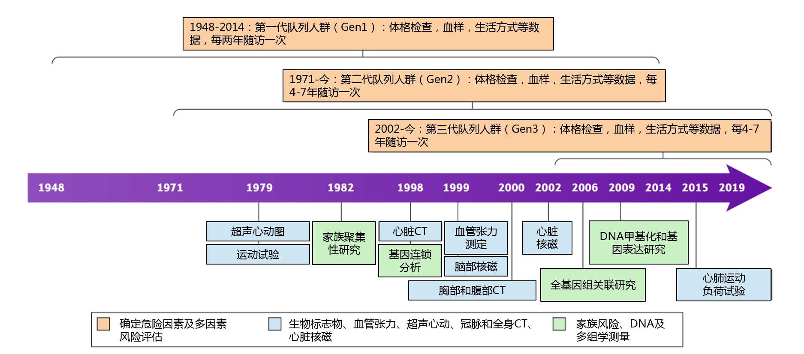
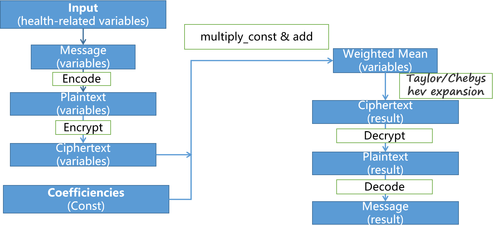

# Framingham Hear Study (FHS)

## Introduction

### Framingham Heart Study

**Framingham Heart Study (FHS)** is the longest duration cardiovascular epidemiological study funded by the National Institutes of Health in 1948, aimed at improving understanding of the epidemiology of coronary heart disease in the United States. FHS indicates that cardiovascular disease is closely related to various factors such as age, blood pressure, cholesterol, height, weight, etc. Therefore, these health-related parameters can be used to predict the probability of cardiovascular disease. The following picture illustrates the history of FHS.

 

### Formula of Cardiovascular Diseases Prediction

Based on the simplified FHS research dataset, we conclude that cardiovascular disease is closely related to the factor of age, systolic blood pressure (SBP), diastolic blood pressure (DBP), total cholesterol (CHL), height and weight.

The factor parameter `x` can be calculated by the following formula:

$$x = 0.072 \cdot Age + 0.013 \cdot SBP - 0.029 \cdot DBP + 0.008 \cdot CHL - 0.053 \cdot height + 0.021 \cdot weight$$

The probability of suffering from cardiovascular disease can be predicted by the following formula:

$$Pr(CDS) = \frac {e ^ x} {1 + e ^ x}$$

 

### Private Cardiovascular Diseases Prediction with FHE

The traditional cardiovascular diseases prediction may reveal the information of the patience. 

In order to avoid the leak of personal information, we implement the technology of fully homomorphic encryption to achieve this goal.

With the Poseidon library, we can realize the privacy-protected cardiovascular diseases prediction as following:

1. Users encrypt personal information with the secret key, and uploads the personal information ciphertext.
2. The third-party receives the ciphertext from users, and executes the homomorphic prediction computation. After the homomorphic computation, the third-party returns the result ciphertext to users.
3. Users decrypt the result ciphertext getting the prediction of their probability of suffering from cardiovascular diseases.

 

## Implementation

Our private cardiovascular diseases prediction example is based on CKKS scheme as the data may be float-point.

The following flowchart illustrate the private prediction process:

The evaluation of probability of suffering from cardiovascular diseases includes homomorphic addition, homomorphic addition of constant, homomorphic multiplication and rescaling,  where all these homomorphic evaluations are supported in Poseidon library.

 

## Source Code

See [github](https://github.com/luhang-HPU/Trident/blob/main/heartstudy/heartstudy.cpp) for details.

## Performance (TBD)

The environment is as follows:

* System: Ubuntu 20.04.6 LTS
* CPU: Intel(R) Xeon(R) Platinum 8160 CPU @ 2.10GHz
* RAM: 128G
* HPU: ZJ-1

 

|            | Software | HPU  |
| ---------- | -------- | ---- |
| Total Time |          |      |

