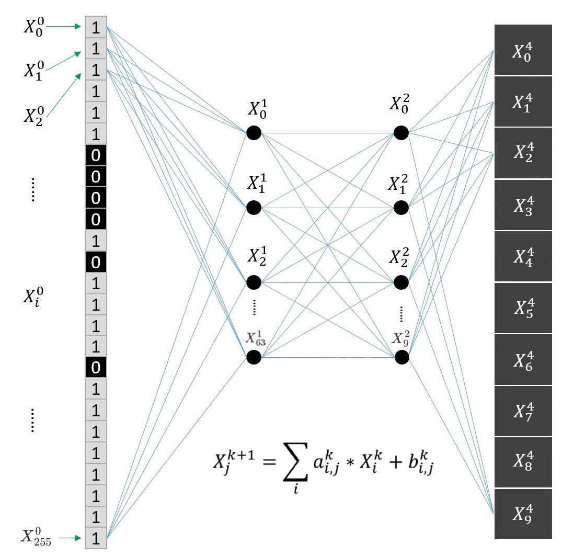

# MNIST-CNN


## Introduction

The MNIST dataset is a training set for image recognition, containing handwritten digits from 0 to 9. It is derived from the National Institute of Standards and Technology (NIST). The training set consists of handwritten digits from 250 different people, with 50% coming from high school students and 50% from staff of the Census Bureau. The test set also contains handwritten digits in the same proportion, but it is ensured that the sets of authors for the test set and the training set are disjoint.

The MNIST dataset contains a total of 70,000 images, with 60,000 in the training set and 10,000 in the test set. Each image is a 28×28 handwritten digit picture of numbers from 0 to 9. All images are in the form of a black background with white characters. The black background is represented by 0, and the white characters are represented by floating-point numbers between 0 and 1. The closer the value is to 1, the whiter the color.

The data is processed to generate a model after being trained in PyTorch   , and this application recognizes the data through the model in a confidential state.

<br>

## Implementation

### Basics

First, the image is in an encrypted state. Then, a convolution operation is performed on the image, followed by two fully connected layers. Finally, softmax is used for normalization to calculate probabilities.


<br>

**Conv**: Convolution with 4 kernels. Shape of the kernel is 7 x 7. Strides are 3 x 3. As shown in the figure, expand the data to be calculated and perform matrix multiplication.

After the convolution layer multiplies the input vector by the convolution kernel, it performs rotation and accumulation, then obtains an output vector of length 256 through a mask, followed by adding a bias, and finally applies the square activation function.
<br>

**Activation**: Square activation function.
**Linear Layer 1**:  Input size: 256. Output size: 64.
**Activation**: Square activation function.
**Linear Layer 2**:  Input size: 64. Output size: 10.



<br>

## Source Code

**Variables**
* `conv_kernels` (std::vector<std::vector<double>>): Contains 4 convolutional cores, each volume The core has 49 elements. Row-first storage.
* `fc1_weights` (std::vector<std::vector<double>>): Full connection weight, size: 256 ∗ 64.
* `fc1_bias_vec` (std::vector<double>): Full connection bias, size: 64;
* `fc2_weights` (std::vector<std::vector<double>>): Full connection weight, size: 64 ∗ 10.
* `fc2_bias_vec` (std::vector<double>): Full connection bias, size: 10;

**Validation function**
```cpp
std::vector<double> rotation(std::vector<double> input, int shift);
```
It is used for the verification of convolutional layers. To ensure that the verification method is consistent with the actual ciphertext method, the rotation function is used for rotation, followed by accumulation.
* `input` (std::vector<double>): Input
* `shift` (int): The rotation step

<br>

```cpp
std::vector<double> take_real(std::vector<complex<double>>& input);
```
Before applying softmax, only the real parts of the vector obtained after decrypting and decoding the ciphertext are taken.
* `input` (std::vector<double>): Input
<br>

```cpp
std::vector<double> matrixVectorMultiply(const std::vector<std::vector<double>>& matrix, const std::vector<double>& vec){}
```
For verifying the results of the fully connected layer, directly multiply the plaintext input vector (on the right) by the fully connected layer matrix.
* `matrix` (const std::vector<std::vector<double>>&): Fully connected layer matrix
* `vec` (const std::vector<double>&): The plaintext input vector
<br>

**Functions for CNN**

```cpp
std::vector<double> softmax(std::vector<double>& logits);
```
Calculating probability through normalization.
* `logits` (std::vector<double>&): Input
<br>

```cpp
std::vector<double> preprocess_image(const std::vector<std::vector<int>>& image, size_t ker_size, size_t stride);
```
Convert the input image (28 ∗ 28) matrix into a convolution-friendly vector, resulting in an im2col-form vector with a length of 3136.
* `image` (const std::vector<std::vector<int>>&): Image data
* `ker_size` (size_t): Size of the convolution kernel
* `stride` (size_t): Stride
<br>

```cpp
std::vector<float> load_binary_param(const std::string& filename);
```
First, the model trained by PyTorch will be saved in the model.pt format. Then, the parameters (weights and biases) of each layer are saved separately into bin files, and this function can be used in C++ to read the parameters.
* `filename` (const std::string& ): File name
<br>

```cpp
std::vector<double> replicate(const std::vector<double>& kernel, int windows = 64);
```
During convolution operations, since the input vector is elongated, the convolution kernel must be duplicated to the same length for multiplication.
* `kernel` (const std::vector<double>&): Convolution kernel
* `windows` (int): The length to be replicated
<br>

## Performance (TBD)

The environment is as follows:

* System: Ubuntu 20.04.6 LTS
* CPU: Intel(R) Xeon(R) Platinum 8160 CPU @ 2.10GHz
* RAM: 128G
* HPU: ZJ-1

<br>

|            | Software | HPU |
| ---------- | -------- | --- |
| Total Time |          |     |
