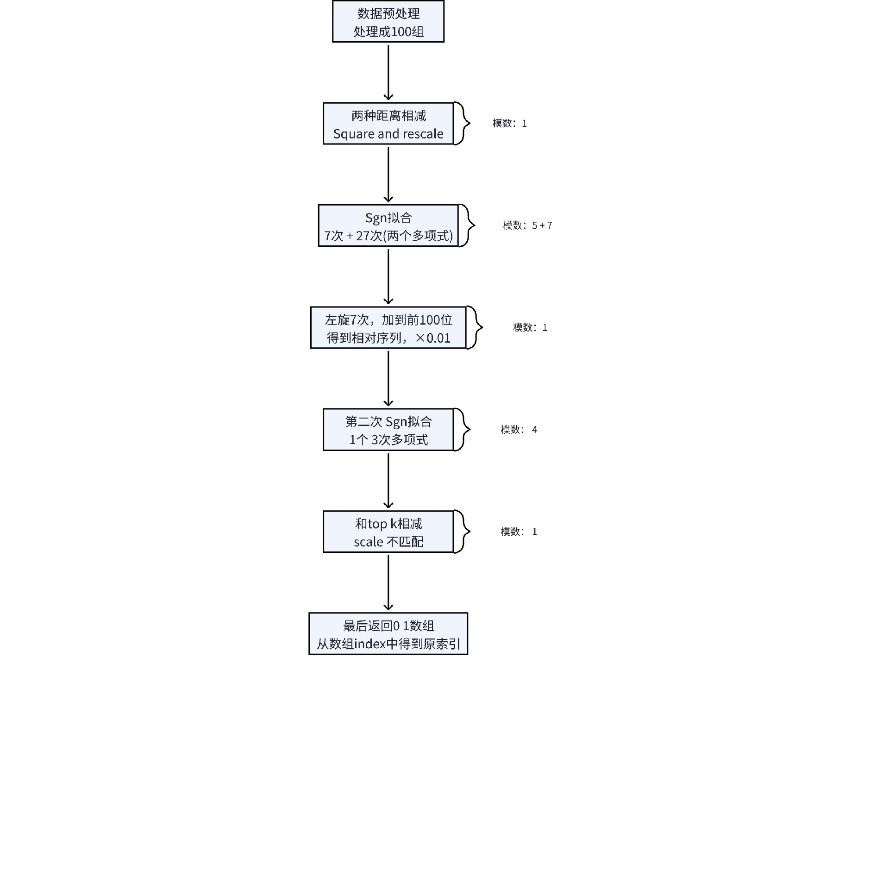
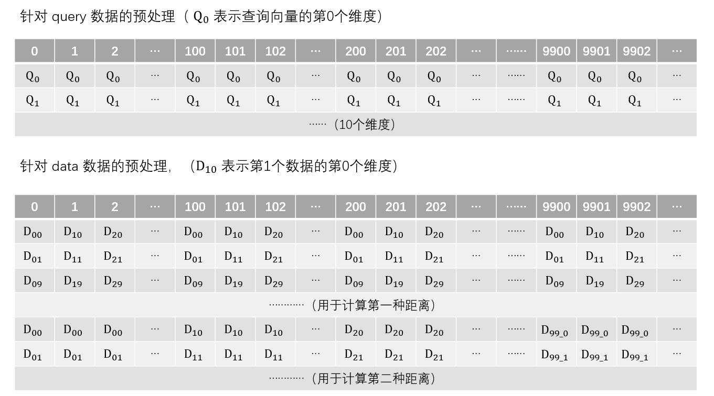

# K-Nearest Neighbor (KNN)


## Introduction

### KNN

KNN follows the idea of "similar data points cluster together": A new test point’s label (classification) or value (regression) is determined by its *K closest training data points* (neighbors). For classification, it uses the **majority label** of the K neighbors; for regression, it takes the **average value** of the K neighbors.


This algorithm aims to accomplish a Top-K similarity query task using homomorphic encryption technology (CKKS) on the premise of preserving data privacy. The inputs are an encrypted query vector and an encrypted dataset, and the goal is to find the top K data points that are most similar to the query vector.

<br>


### Target and Process

The aim of our application is to find the nearest 10 vectors to the query vector from 100 vectors.


There are three parties in this application -- the query party, the data party and the computing party. The query party owns one query vector. The data party owns the 100 vector. Before the process, both the query party and the data owner party encrypt their data into ciphertexts and sends these ciphertexts to the computing party. After the computing party receives the ciphertexts, it performs homomorphic KNN algorithm and return the result to the query party, where the result contains the nearest 10 vectors to the query vector.


### Parameter Format

The security parameters of CKKS scheme:

* log_degree : 15
* log_slot : 14
* modulus chain of q : 21 * 32-bit primes
* modulus chain of p : 1 * 60-bit prime
* scaling_factor : $2^{32}$

<br>


## Implementation

**Idea** : The general process of the algorithm is as follows: subtract the corresponding dimensions of each vector → square the results → sum the results of each dimension (no square root is needed, i.e., obtaining the Euclidean distance). In the homomorphic environment, the sub_and_square operation is used to complete the difference and squaring calculations. Then, an approximate Sign function (polynomial fitting) is used to determine the magnitude relationship between two distances, resulting in a 0/1 comparison result. Through multiple rotation and accumulation operations, the "number of wins" for each point relative to other points is counted to form a relative ranking. The "relative position" is compared again with the Top-10 threshold to obtain the binarized ciphertext of the final top 10 results. After decryption, the positions with an index value of 1 are the 10 nearest data points.


**Process** :




**Step(1) Initiation** 

Setting the security parameters of CKKS.


**Step(2) Preprocess**

The query party owns the query vector with 10-dimension. It constructs 10 vectors and fulfills the i-th vector with the i-th dimension.

The data party owns 100 vectors with 10-dimension. It extends the data like the following picture.

The query party and the data party encrypts their vectors and sends the ciphertexts to the computing party.





**Step(3) Computing the distance**

Subtracting ciphertexts from the query party from ciphertexts from the data party in every dimension.

Squaring and adding the result ciphertexts to get the squared Euclidean distance.

```c++
sub_and_square(ckks_eva, ciph_data, ciph_query, relin_keys, scale);
```


**Step(4) Subtracting two different distance**

Subtracting two kinds of distance ciphertexts.

```c++
ckks_eva->sub_dynamic(ciph_distance_1, ciph_distance_2, ciph_result,
ckks_encoder);
```


**Step(5) Fitting the sign function**

In this step, it performs two rounds of polynomial fitting. A 7-degree polynomial is used in the first round of fitting and a 27-degree polynomial is used in the second round of fitting.

```c++
ciph_tmp = sign_1(ciph_result, polys, polys_1, ckks_encoder, ckks_eva, relin_keys, dec, enc, scale, rot_keys);
```


**Step(6) Rotation and accumulation**

```c++
ciph_result = accumulate_top_n_block(ciph_tmp, 100, ckks_encoder, enc, ckks_eva, rot_keys);
```


**Step(7) Fitting the sign function again**

It subtracts the ciphertext in the relative position getting the result ciphertext in which the nearest 10 results are positive value and the else are negative in the ciphertext slots.

At last, a 3-degree polynomial fitting is performed on the result ciphertext for binarization.


**Step(8) Returning and decrypting**

The query party decrypts and decodes the ciphertext which is returned from the computing party. The ones in the message vector corresponds the nearest 10 vectors.

<br>


## Source Code

```c++
void read_jsonl_query(const std::string &file,
                      std::vector<std::vector<std::complex<double>>> &query)
```

**Usage** : Read the query vectors from the Json file.


```c++
void read_jsonl_data(const std::string &file,
                     std::vector<std::vector<std::complex<double>>> &matrix_data)
```

**Usage** : Read the data vectors from the Json file.


```c++
void sub_and_square(const std::shared_ptr<EvaluatorCkksBase> &ckks_eva,
                    std::vector<Ciphertext> &ciph_data, 
                    const std::vector<Ciphertext> &ciph_query, 
                    const poseidon::RelinKeys &relin_keys, const double scale)
```

* `ckks_eva` (const std::shared_ptr\<EvaluatorCkksBase\>) : The evaluator
* `ciph_data` (std::vector\<Ciphertext\> &) : the ciphertexts from the data party
* `ciph_query` (const std::vector\<Ciphertext\> &) : the ciphertexts from the query party
* `relin_keys` (const poseidon::RelinKeys &) : the relinearization key
* `scale` (const double) : the scaling factor

**Usage** : It subtracts the `ciph_data` from the `ciph_query` in every dimension.


```c++
Ciphertext sign_1(const Ciphertext &ciph,
                  const PolynomialVector &polys_1,
                  const PolynomialVector &polys_2,
                  const CKKSEncoder &encoder,
                  std::shared_ptr<EvaluatorCkksBase> eva,
                  const RelinKeys &relin_keys)
```

* `ciph` (const Ciphertext &) : the ciphertext to perform the sign function
* `polys_1` (const PolynomialVector &) : the polynomial for the first round of fitting the sign function
* `polys_2` (const PolynomialVector &) : the polynomial for the second round of fitting the sign function
* `encoder` (const CKKSEncoder &) : the batch encoder for CKKS
* `eva` (std::shared_ptr\<EvaluatorCkksBase\>) : the evaluator
* `relin_keys` (const poseidon::RelinKeys &) : the relinearization key

**Usage** : `sign_1` approximately fits the sign function with two rounds of polynomial computation.


```c++
Ciphertext sign_2(const Ciphertext &ciph,
                  const PolynomialVector &polys,
                  const CKKSEncoder &encoder,
                  std::shared_ptr<EvaluatorCkksBase> eva,
                  const RelinKeys &relin_keys)
```

* `ciph` (const Ciphertext &) : the ciphertext to perform the sign function
* `polys` (const PolynomialVector &) : the polynomial for fitting the sign function
* `encoder` (const CKKSEncoder &) : the batch encoder for CKKS
* `eva` (std::shared_ptr\<EvaluatorCkksBase\>) : the evaluator
* `relin_keys` (const poseidon::RelinKeys &) : the relinearization key

**Usage** : `sign_2` approximately fits the sign function with single round of polynomial computation.


```c++
Ciphertext accumulate_top_n_block(const Ciphertext &ciph, int n, 
                                  const CKKSEncoder&encoder, const Encryptor &enc, 
                                  std::shared_ptr<EvaluatorCkksBase> ckks_eva, 
                                  const GaloisKeys rot_keys)
```

* `ciph` (const Ciphertext &) : the input ciphertext
* `n` (int) : the range of accumulation
* `encoder` (const CKKSEncoder &) : the encoder
* `enc` (const Encryptor &) : the encryptor
* `ckks_eva` (std::shared_ptr\<EvaluatorCkksBase>) : the evaluator for homomorphic computations
* `rot_keys` (const GaloisKeys &) : the rotation key

**Usage** : It accumulates the top n slots and stores the result into the first slot. It can be expressed by the equation $slot[0] = \sum\limits_{i=0}^{n-1}slot[i]$ . Pay attention that the origin slots in the ciphertext will be changed!

<br>


## Performance (TBD)

The environment is as follows:

* System: Ubuntu 20.04.6 LTS
* CPU: Intel(R) Xeon(R) Platinum 8160 CPU @ 2.10GHz
* RAM: 128G
* HPU: ZJ-1

<br>

|            | Software | HPU  |
| ---------- | -------- | ---- |
| Total Time |          |      |

