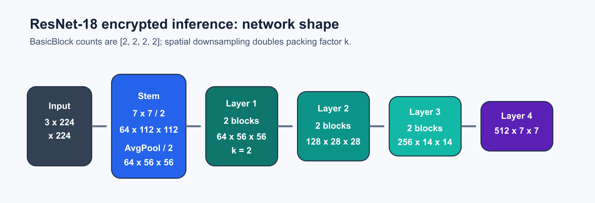
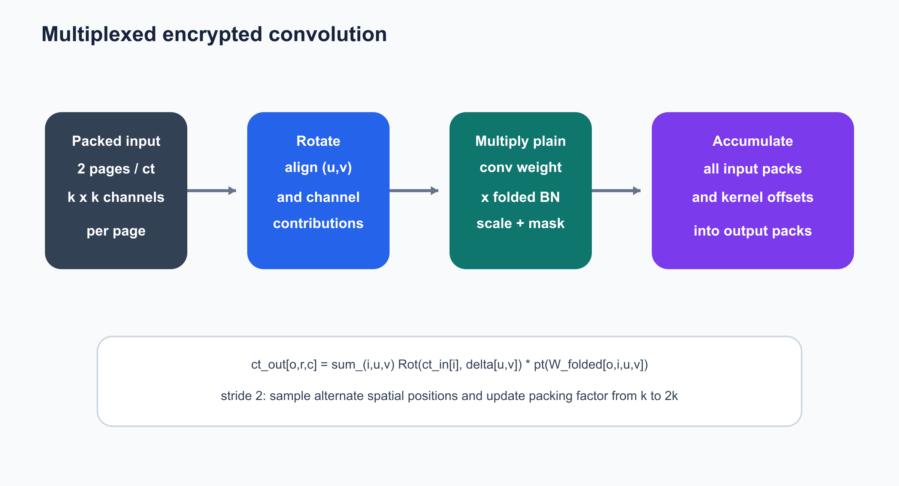

# ResNet-18 Encrypted Inference

## Introduction

### ResNet-18

This page describes how `Trident/resnet18` uses Poseidon CKKS to perform encrypted
ResNet-18 inference on ImageNet. The input is a `3 x 224 x 224` image, and the
output consists of 1,000 ImageNet class logits.

The current implementation uses the BasicBlock variant of ResNet-18. Standard
max pooling requires comparisons, which CKKS cannot evaluate directly, so the
stem replaces it with a `3 x 3`, stride-2 average-pooling layer with the same
output dimensions.



| Network component | Number of blocks | Output shape |
| --- | ---: | ---: |
| Stem: `7 x 7` convolution | 1 | `64 x 112 x 112` |
| Stem: `3 x 3` average pooling | - | `64 x 56 x 56` |
| Layer 1 | 2 | `64 x 56 x 56` |
| Layer 2 | 2 | `128 x 28 x 28` |
| Layer 3 | 2 | `256 x 14 x 14` |
| Layer 4 | 2 | `512 x 7 x 7` |
| Global average pooling + FC | - | 1,000 logits |

The plaintext logic of a BasicBlock is:

```text
y = ReLU(F(x; W) + S(x))

F: 3x3 conv -> BN -> ReLU -> 3x3 conv -> BN
S: identity, or 1x1 stride-2 projection -> BN
```

Model weights participate in the CKKS computation as plaintexts, while the
input and intermediate activations remain encrypted. The current program also
retains the secret key in the same process and decrypts intermediate results
for layer-by-layer correctness checks. It is therefore a research and
validation prototype rather than an evaluator-only production deployment.

### CKKS and Polynomial ReLU

CKKS supports approximate SIMD addition, multiplication, and rotation, but it
does not directly support comparisons. The implementation approximates a step
function with three composed polynomials and then computes ReLU:

```text
ReLU(x) ~= x * (P3(P2(P1(x))) + 0.5)
degree(P1, P2, P3) = (15, 15, 27)
```

The current parameters are:

| Parameter | Current value |
| --- | ---: |
| Polynomial modulus degree | `N = 2^16` |
| CKKS slots | `2^15 = 32768` |
| Default scale | approximately `2^46` |
| Q chain | `1 x 51-bit + 20 x 46-bit + 14 x 51-bit` |
| Special modulus P | `1 x 51-bit` |
| Input/activation bound | `B = 20` |
| Logical bootstrap positions | 16 |
| Per-ciphertext bootstrap calls with the current packing | 60 |

## Implementation

The encrypted data flow is:

```text
preprocessing and scaling
-> input encryption and stem im2col
-> multiplexed packing
-> 8 encrypted BasicBlocks
-> global average pooling
-> diagonal-matrix FC
-> decrypt logits and compute argmax
```

### Step 1: Input Encryption and the Stem

Each ImageNet sample contains the following number of values in CHW order:

```text
3 x 224 x 224 = 150528 values
```

The input is first divided by the global bound `B = 20`. The implementation
then constructs the im2col layout directly for the first convolution. With 3
input channels and a `7 x 7` kernel, it encrypts 147 patch ciphertexts. The
12,544 active slots in each ciphertext correspond to the `112 x 112` output
spatial positions.


```text
stem patch ciphertexts = 3 x 7 x 7 = 147
active slots / ciphertext = 112 x 112 = 12544

ct_out[o] = sum_(i,u,v) ct_patch[i,u,v] * pt(folded_weight[o,i,u,v])
```

The convolution weights already include the multiplicative part of batch
normalization:

```text
folded_weight[o,i,u,v]
  = weight[o,i,u,v] * gamma[o] / sqrt(var[o] + epsilon)
```

The BN offset is subsequently added with `add_plain`. The corresponding entry
point is:

```cpp
Im2ColCipherGroup conv1_im2col = encrypt_conv2d_im2col_patches(
    image_values, 224, 224, 3, 2, 7, 7,
    runtime, plan.log_scale);

ChannelCipherGroup encrypted_stem =
    encrypted_conv2d_im2col_all_channels(
        conv1_im2col, 64, weights.conv_weight[0],
        weights.bn_running_var[0], weights.bn_weight[0],
        kBatchNormEpsilon, runtime);
```

### Step 2: Multiplexed Ciphertext Layout

The first convolution initially produces 64 ciphertexts, one for each channel.
These ciphertexts are then converted into the multiplexed layout. Each
ciphertext contains two pages, and each page interleaves `k x k` logical
channels.

```text
channels_per_page       = k * k
channels_per_ciphertext = 2 * k * k
page_size               = (H * k) * (W * k)
ciphertext_count        = ceil(C / (2 * k * k))
```

Each stride-2 operation halves `H` and `W` while doubling `k`. The following
invariant is therefore preserved throughout the network:

```text
H * k = W * k = 112
page_size = 112 * 112 = 12544 slots
```


| Position | Logical shape `C x H x W` | `k` | Maximum channels per ciphertext | Ciphertexts |
| --- | ---: | ---: | ---: | ---: |
| Packed stem | `64 x 112 x 112` | 1 | 2 | 32 |
| Stem avgpool / Layer 1 | `64 x 56 x 56` | 2 | 8 | 8 |
| Layer 2 | `128 x 28 x 28` | 4 | 32 | 4 |
| Layer 3 | `256 x 14 x 14` | 8 | 128 | 2 |
| Layer 4 | `512 x 7 x 7` | 16 | 512 | 1 |

A logical tensor may be represented by multiple packed ciphertexts. The
logical bootstrap positions described below refer to positions in the network
graph, while the number of actual bootstrap calls also depends on the number
of ciphertexts at each position.

### Step 3: Encrypted BasicBlock

ResNet-18 contains 8 BasicBlocks, each with two `3 x 3` convolutions and two
activation points.


The main branch executes:

```text
3x3 conv1 + folded BN scale
-> BN offset
-> bootstrap
-> polynomial ReLU
-> 3x3 conv2 + folded BN scale
-> BN offset
```

The main branch and shortcut are then aligned to the same modulus level and
added. A second `bootstrap -> polynomial ReLU` follows the residual addition.
Layer 1 uses identity shortcuts, while the first block in Layers 2, 3, and 4
uses a `1 x 1`, stride-2 projection shortcut. Before an encrypted residual
addition, both operands are dropped to the same `parms_id`:

```cpp
if (lhs_chain > rhs_chain) {
    evaluator.drop_modulus(lhs_cipher, lhs_cipher, rhs_cipher.parms_id());
} else if (rhs_chain > lhs_chain) {
    evaluator.drop_modulus(rhs_cipher, rhs_cipher, lhs_cipher.parms_id());
}
evaluator.add_dynamic(lhs_cipher, rhs_cipher, output, encoder);
```

### Step 4: Multiplexed Encrypted Convolution

The main convolutions operate directly on packed ciphertexts using rotations,
plaintext multiplications, masks, and accumulation. They do not unpack the
tensor into one ciphertext per channel.



```text
ct_out[o,r,c]
  = sum_(i,u,v)
      Rot(ct_in[i], delta[u,v])
      * pt(folded_weight[o,i,u,v])
```

The operation proceeds as follows:

1. Rotations align the neighboring spatial positions and input-channel
   contributions required by the convolution kernel.
2. Each rotated ciphertext is multiplied by a plaintext vector containing the
   convolution weights, BN scale, and selection mask.
3. All input packs and kernel offsets are accumulated after rescaling.
4. The result is placed in the target output pack. For stride-2 operations,
   `k` is simultaneously updated to `2k`.

### Step 5: Bootstrapping and ReLU

Multiplication and rescaling gradually consume the Q chain. Except for the
first ReLU in the stem, every activation point is preceded by bootstrapping to
restore the levels required by the polynomial and normalize the scale to
approximately `2^46`.


```cpp
Ciphertext result = cnn_in.cipher();
evaluator.bootstrap(result, result, relin_keys, galois_keys,
                    encoder, bootstrap_config);
normalize_bootstrap_output_scale(result, bootstrap_context);
```

#### Why There Are 16 Logical Positions but 60 Actual Calls

Each BasicBlock has two activation points that require bootstrapping:

```text
8 blocks x 2 activation points = 16 logical positions
```

Bootstrap operates on individual packed ciphertexts rather than on an abstract
whole-layer tensor:

| Stage | Blocks | Activation points per block | Ciphertexts per position | Per-ciphertext calls |
| --- | ---: | ---: | ---: | ---: |
| Layer 1 | 2 | 2 | 8 | 32 |
| Layer 2 | 2 | 2 | 4 | 16 |
| Layer 3 | 2 | 2 | 2 | 8 |
| Layer 4 | 2 | 2 | 1 | 4 |
| Total | 8 | 16 logical positions | - | **60** |

Thus, 16 logical bootstrap positions describe the network graph, while 60
per-ciphertext calls describe the evaluator work under the current packing.

### Step 6: Encrypted Classification Head

The `512 x 7 x 7` output of Layer 4 fits in one ciphertext. Global average
pooling first performs column-wise rotation-adds, then row-wise rotation-adds,
and finally compacts the 512 channel base positions into slots `0..511`.

```text
pooled[c] = (B / 49) * sum_(r=0..6,c=0..6) feature[c,r,c]
```

Here, `B / 49 = 20 / 49` performs the spatial average and restores the earlier
boundary scaling at the same time.


The FC weight matrix has shape `1000 x 512`. Instead of producing one
ciphertext for each class, the implementation uses 1,511 matrix diagonals and
writes all 1,000 logits into the first 1,000 slots of one output ciphertext:

```text
logits
  = sum_(d=0..1510)
      Rot(features, 511-d) * pt(diagonal_d(W))
    + bias
```

The implementation entry point is:

```cpp
matrix_multiplication(
    encrypted_head_pooled, encrypted_head_logits,
    weights.linear_weight, weights.linear_bias,
    kImageNetClassCount, kResNet18FinalChannels,
    *runtime.evaluator, runtime.galois_keys, runtime.encoder);
```

Only the first 1,000 slots are decrypted at the validation boundary, after
which `argmax` selects the predicted class.

## Source Code

| File | Purpose |
| --- | --- |
| `infer.cpp` | End-to-end encrypted inference, layout conversion, 8 BasicBlocks, and logging |
| `infer_config.*` | Network constants, CKKS modulus chain, and ReLU parameters |
| `infer_runtime.*` | Poseidon context, encoder, evaluator, and keys |
| `encrypted_group_ops.*` | Stem im2col and first convolution |
| `encrypted_ops.*` | Single-ciphertext bootstrap and diagonal matrix multiplication |
| `relu_approx.*` | Composed-polynomial ReLU |
| `parameter_loader.*` | torchvision parameters and ImageNet input loading |
| `plain_cnn.*` | Synchronized plaintext reference computation |
| `progress_log.*` | Operator timing, level, scale, and error logs |

The encrypted entry point is:

```cpp
void ResNet_imagenet_sparse(
    size_t start_image_id,
    size_t end_image_id);
```

## Build and Run

After building the Poseidon dependencies from the repository root, configure
Trident:

```bash
cmake -S Trident -B Trident/build \
  -DCMAKE_BUILD_TYPE=Release \
  -DRESNET18=ON

cmake --build Trident/build --target resnet18 resnet18_plain -j4
RESNET18_THREADS=16 \
./Trident/build/resnet18/resnet18 0 0
```

Logs are written to:

```text
Trident/resnet18/result/
```
