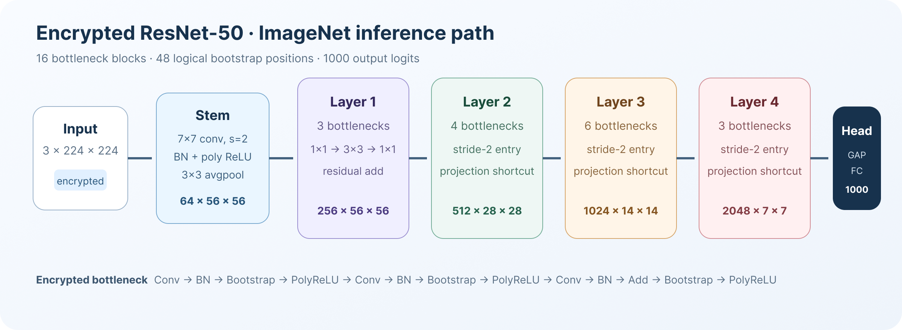
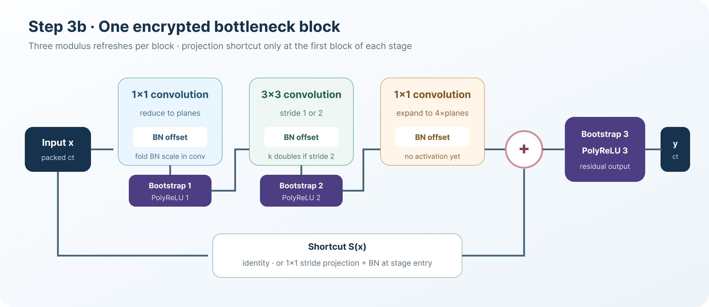
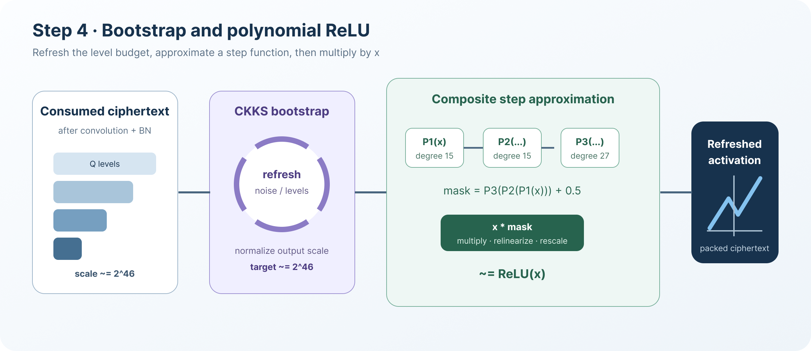
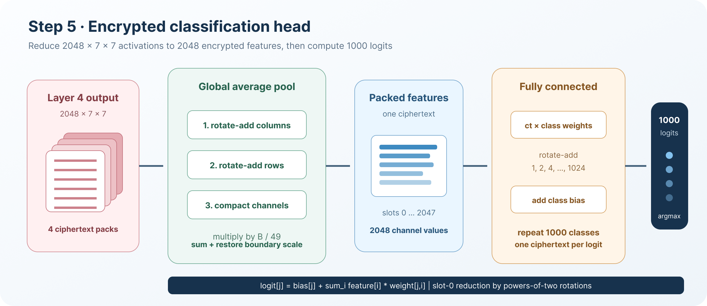

# ResNet-50 Encrypted Inference

**Language:** English | [中文](resnet50.zh.md)

## Introduction

### ResNet-50

ResNet-50 is a 50-layer convolutional neural network for image classification.
Its core component is the bottleneck residual block. The main branch performs
three convolutions and is added to the shortcut branch before the final
activation:

$$
\mathbf{y} =
\operatorname{ReLU}\left(
F(\mathbf{x};\mathbf{W}) + S(\mathbf{x})
\right).
$$

Here, \(F\) denotes the three-convolution bottleneck branch, while \(S\) is
either an identity mapping or a projection. `Trident/resnet50` uses torchvision
ResNet-50 parameters to classify a `3 x 224 x 224` image into 1,000 ImageNet
classes.



The current implementation uses the following network shapes:

| Network component | Number of blocks | Output shape |
| --- | ---: | --- |
| Stem: `7 x 7` convolution | 1 | `64 x 112 x 112` |
| Stem: `3 x 3` average pooling | - | `64 x 56 x 56` |
| Layer 1 | 3 | `256 x 56 x 56` |
| Layer 2 | 4 | `512 x 28 x 28` |
| Layer 3 | 6 | `1024 x 14 x 14` |
| Layer 4 | 3 | `2048 x 7 x 7` |
| Global average pooling + FC | - | 1,000 logits |

### Privacy-Preserving Inference

In the target data flow, the input image and every intermediate activation are
encrypted with Poseidon's CKKS implementation. Model parameters remain
unencrypted and are encoded as CKKS plaintext multipliers. The current research
prototype performs input encryption locally and retains both the secret key
and plaintext reference values for layer-by-layer correctness checks. It is
therefore not yet an evaluator-only production deployment. The encrypted path
prevents homomorphic operators from directly observing the input and
intermediate features, but it does not protect the model weights.

CKKS supports approximate SIMD addition and multiplication but cannot directly
perform comparisons. The standard ReLU is therefore replaced by a composed
polynomial:

$$
\operatorname{ReLU}(x)
\approx x\left(P_3(P_2(P_1(x))) + 0.5\right).
$$

The default component degrees are `[15, 15, 27]`. Bootstrapping restores the
available modulus levels before each activation inside a bottleneck. The stem
activation is the only activation that does not require a preceding bootstrap.

The current cryptographic parameters are:

| Parameter | Current value |
| --- | ---: |
| Polynomial modulus degree | `N = 2^16` |
| CKKS slots | 32768 |
| Default scale | approximately `2^46` |
| Q chain | `1 x 51-bit + 20 x 46-bit + 14 x 51-bit` |
| Special modulus P | 51 bit |
| Input/activation bound | `B = 120` |
| Logical bootstrap positions | 48 |
| Estimated per-ciphertext bootstrap calls | 351 |

## Implementation

Encrypted inference consists of the following steps:

1. Normalize and encrypt the input image.
2. Compute the stem convolution and convert its output to multiplexed packing.
3. Evaluate 16 encrypted bottleneck blocks.
4. Restore modulus levels with bootstrapping and evaluate polynomial ReLU.
5. Compute global average pooling and the 1,000-class fully connected layer.
6. Decrypt the final logits and select the class with the largest value.

### Step 1: Input Preprocessing and Stem Encryption

Each ImageNet sample contains `3 x 224 x 224 = 150528` values in CHW order.
Before encryption, the input is divided by the global bound `B = 120` to keep
subsequent intermediate values within the approximation interval of the
polynomial ReLU.

The first `7 x 7`, stride-2 convolution uses an im2col layout. For each input
channel and kernel offset, the corresponding image patch is packed into a
ciphertext:


```text
ciphertexts = 3 input channels x 7 x 7 = 147
active slots per ciphertext = 112 x 112 = 12544
```

For a kernel offset `(i,u,v)`, slot `(oh,ow)` stores
`x[i,2oh+u-3,2ow+v-3]`. Positions outside the image are filled with zero.
Corresponding slots in all 147 ciphertexts therefore represent the same output
spatial coordinate. An encrypted output channel can be computed without
rotating ciphertexts:

$$
\mathrm{ct}_{o}
=
\sum_{i=0}^{2}\sum_{u=0}^{6}\sum_{v=0}^{6}
\mathrm{ct}_{i,u,v}\cdot
\mathrm{pt}\left(W'_{o,i,u,v}\right).
$$

The 64 convolution outputs are initially represented by 64 ciphertexts, one
for each output channel.

The multiplicative part of batch normalization is folded into the convolution
weights:

$$
W'_{o,i,u,v} =
W_{o,i,u,v}
\cdot\frac{\gamma_o}{\sqrt{\sigma_o^2+\epsilon}}.
$$

The first convolution is implemented as:

```cpp
Im2ColCipherGroup conv1_im2col = encrypt_conv2d_im2col_patches(
    image_values, 224, 224, 3, 2, 7, 7, runtime, plan.log_scale);

ChannelCipherGroup encrypted_stem =
    encrypted_conv2d_im2col_all_channels(
        conv1_im2col, 64, weights.conv_weight[0],
        weights.bn_running_var[0], weights.bn_weight[0],
        kBatchNormEpsilon, runtime);
```

### Step 2: Multiplexed Ciphertext Packing

The network body uses a multiplexed layout. Each ciphertext contains two
pages, and each page interleaves \(k^2\) channels in its spatial grid.


For a logical tensor with shape `(C, H, W)`, the layout satisfies:

```text
channels per page       = k^2
page_size               = (H x k) x (W x k)
channels per ciphertext = 2k^2
ciphertext count        = ceil(C / (2k^2))
```

A logical value `(channel, row, column)` maps to:

```text
slot = local_page x page_size
     + (row x k + row_offset) x (W x k)
     + (column x k + column_offset)
```

Whenever a stride-2 operation halves `H` and `W`, the implementation doubles
`k`. Consequently, `H x k = W x k = 112` throughout the network, and each page
always contains 12,544 slots.

| Position | `H x W` | Channels | `k` | Ciphertexts |
| --- | ---: | ---: | ---: | ---: |
| Packed stem | `112 x 112` | 64 | 1 | 32 |
| Stem average pooling | `56 x 56` | 64 | 2 | 8 |
| Layer 1 output | `56 x 56` | 256 | 2 | 32 |
| Layer 2 output | `28 x 28` | 512 | 4 | 16 |
| Layer 3 output | `14 x 14` | 1024 | 8 | 8 |
| Layer 4 output | `7 x 7` | 2048 | 16 | 4 |

### Step 3: Encrypted Bottleneck Blocks

Each bottleneck evaluates three encrypted convolutions. The first and third
use `1 x 1` kernels, and the middle convolution uses a `3 x 3` kernel. The
first block of every stage also computes a projection shortcut.


For a multiplexed convolution, the implementation first uses spatial
rotations to align the neighboring positions required by the kernel. Each
rotated ciphertext is multiplied by a plaintext vector that contains both
convolution weights and the folded BN scale. Rotation-add operations then
reduce the interleaved input-channel contributions, and selection masks move
each output channel to the appropriate row offset, column offset, and page.
For output channel \(o\) at logical position \((r,c)\), the computation is:

$$
\mathrm{ct}_{o,r,c}
=
\sum_i\sum_{u,v}
\mathrm{Rot}\left(
\mathrm{ct}_{i},\Delta_{u,v}
\right)
\cdot
\mathrm{pt}\left(W'_{o,i,u,v}\right).
$$

Output channels assigned to the same target pack are accumulated in the same
ciphertext. A stride-2 convolution samples every other spatial position and
updates the interleaving factor from `k` to `2k`.



```text
Main branch:
  1x1 conv -> BN -> bootstrap -> polynomial ReLU
  3x3 conv -> BN -> bootstrap -> polynomial ReLU
  1x1 conv -> BN -------------------------------+
                                                   +-> residual add
Shortcut branch ----------------------------------+
  -> bootstrap -> polynomial ReLU
```

Before an encrypted residual addition, the two branches are aligned to the
same modulus level:

```cpp
if (lhs_chain > rhs_chain) {
    evaluator.drop_modulus(lhs_cipher, lhs_cipher, rhs_cipher.parms_id());
} else if (rhs_chain > lhs_chain) {
    evaluator.drop_modulus(rhs_cipher, rhs_cipher, lhs_cipher.parms_id());
}
evaluator.add_dynamic(lhs_cipher, rhs_cipher, output, encoder);
```

The block driver connects convolution, BN, residual addition, bootstrap, and
ReLU as follows:

```cpp
encrypted = multiplexed_channel_conv2d_all_channels(...);
encrypted = multiplexed_channel_batch_norm(...);
encrypted = multiplexed_channel_bootstrap(...);
encrypted = multiplexed_channel_homomorphic_relu(...);

// Add the shortcut after the third convolution.
encrypted = multiplexed_channel_add(encrypted, encrypted_shortcut, runtime);
encrypted = multiplexed_channel_bootstrap(...);
encrypted = multiplexed_channel_homomorphic_relu(...);
```

### Step 4: Polynomial ReLU and Bootstrapping

The default ReLU configuration consists of three composed Chebyshev
polynomials:



```cpp
relu_config.comp_no = 3;
relu_config.deg = {15, 15, 27};
relu_config.alpha = 13;
relu_config.scaled_val = 1.7;
relu_config.scalingfactor = 46;
```

After producing an approximate step mask, the evaluator multiplies it by the
encrypted input, performs relinearization and rescaling, and restores the
output scale to approximately `2^46`.

Bootstrapping operates separately on every packed ciphertext:

```cpp
Ciphertext result = cnn_in.cipher();
evaluator.bootstrap(result, result, relin_keys, galois_keys,
                    encoder, bootstrap_config);
normalize_bootstrap_output_scale(result, bootstrap_context);
```

Each bottleneck has three logical bootstrap positions, and ResNet-50 contains
16 bottlenecks. Because a logical tensor can contain multiple ciphertext packs,
the current layout is estimated to require approximately 351 individual
ciphertext bootstrap calls.

### Step 5: Encrypted Classification Head

The `2048 x 7 x 7` output of Layer 4 occupies four ciphertexts. Global average
pooling first sums columns and then rows, after which it compacts the 2,048
channel values into the first 2,048 slots of a single ciphertext. The
implementation also multiplies by:

$$
\frac{B}{H W} = \frac{120}{49}
$$

This computes the spatial average while restoring the earlier global boundary
scaling.

For each of the 1,000 ImageNet classes, the fully connected layer:

```text
1. Encodes the 2,048 weights for the class as a plaintext vector.
2. Multiplies the packed feature ciphertext by that plaintext.
3. Performs rescaling.
4. Accumulates rotations by 1, 2, 4, ..., 1024.
5. Adds the class bias to slot 0.
```

The result consists of 1,000 ciphertexts, with slot 0 of each ciphertext
holding one class logit. The current prototype decrypts these slots and uses
`argmax` to obtain the predicted class.



## Source Code

The implementation is located in `Trident/resnet50`.

| File | Purpose |
| --- | --- |
| `infer.cpp` | End-to-end inference and bottleneck execution |
| `infer_config.*` | Network constants, CKKS modulus chain, and ReLU parameters |
| `infer_runtime.*` | Poseidon context, encoder, evaluator, and keys |
| `encrypted_group_ops.*` | Stem im2col encryption and first convolution |
| `multiplexed_ops.*` | Packed convolution, BN, residual addition, pooling, and FC |
| `encrypted_ops.*` | Bootstrapping and scale normalization |
| `relu_approx.*` | Composed-polynomial ReLU |
| `parameter_loader.*` | ResNet-50 parameters and ImageNet input loading |
| `plain_cnn.*` | Layer-by-layer plaintext reference computation |
| `progress_log.*` | Operator timing, memory, and correctness logs |

The main entry point is:

```cpp
void ResNet50_imagenet_sparse(
    std::size_t start_image_id,
    std::size_t end_image_id);
```

## Build and Run

Build Poseidon and enable only the ResNet-50 application:

```bash
cmake -S . -B build -DCMAKE_BUILD_TYPE=Release
cmake --build build --target poseidon_shared -j4

cmake -S Trident -B Trident/build \
  -DCMAKE_BUILD_TYPE=Release \
  -DCMAKE_CXX_FLAGS="-I$(pwd)/src -L$(pwd)/build -Wl,-rpath,$(pwd)/build" \
  -DBuild_GoogleTest=OFF \
  -DPIR=OFF -DAPSI=OFF -DLR_TRAIN=OFF -DHEARTSTUDY=OFF \
  -DKNN=OFF -DMNIST=OFF -DRESNET20=OFF -DRESNET18=OFF \
  -DRESNET50=ON

cmake --build Trident/build --target resnet50 resnet50_plain -j4
```

First validate the input and weights with the plaintext reference program:

```bash
./Trident/build/resnet50/resnet50_plain 0 0
```

Run inference for one image:

```bash
RESNET50_THREADS=8 \
  ./Trident/build/resnet50/resnet50 0 0
```

## Performance

The current implementation writes operator timings, memory snapshots,
layer-by-layer errors, and final prediction consistency to:

```text
Trident/resnet50/result/
  resnet50_imagenet_run_START_END_TIMESTAMP.txt
```
