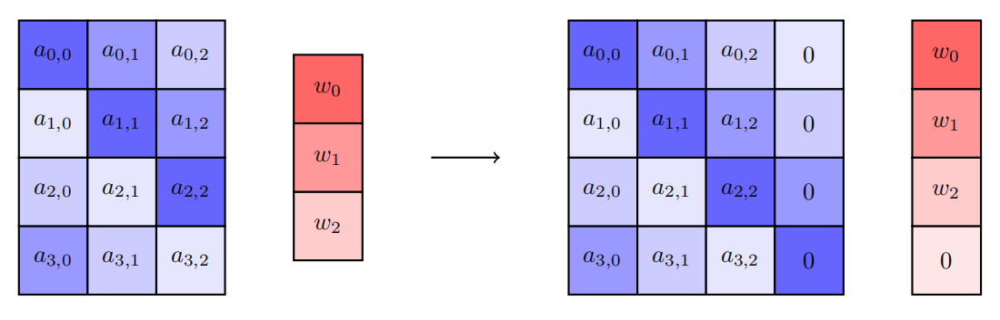
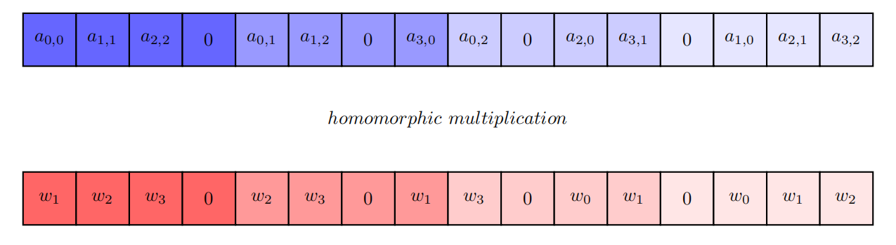
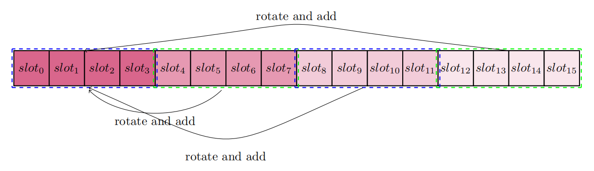

# Logistic Regression Train (LR Train)


## Introduction

Logistic Regression (LR) is actually a classification problem, although it names itself as "regression". It is mainly used for the binary classification, by utilizing the Logistic Function - Sigmoid. Obviously, its value locates within (0, 1). Usually, it takes 0.5 as the threshold, below which it classifies the observed set of inputs as class "0", and vice versa. Sigmoid function is presented as a pretty S-curve.


Logistic regression (LR) is a statistical learning method widely used for **classification problems**, especially in binary classification scenarios. Despite the word "regression" in its name, it is essentially a classification model that makes classification decisions by modeling the probability of events. The core of logistic regression is to **predict the probability of an event occurring**. Using a probability threshold (usually 0.5), samples can be classified into two categories: those with probability ≥ 0.5 are classified as class "1", otherwise as class "0".


#### Sigmoid Function

The primary role of Sigmoid function is to map any real-valued input to a value between 0 and 1, making it ideal for modeling probabilities. It is presented as a S-shaped curve.


The formula of Sigmoid function is as follows:
$$
\sigma(z) = \frac{1}{1 + e^{-z}}
$$

Logistic Regression Classifier aims at learning a binary classification model from the features of the input training data. The model takes the linear combination of the input feature as the variable,$\theta_0+\theta_1x_1+,\ldots,+\theta_nx_n=
\sum_{i=1}^n \theta_ix_i$，where $x_0$ is always 1. We can also present it as $\theta^Tx$.  Putting it into the sigmoid function, we get a prediction model as:
$$
h_\theta(x)=g(\theta^Tx)=\frac{1}{1+e^{-\theta^Tx}}
$$
LR finally maps the combination variable to (0, 1) to determine the class of the input features. 

In order to train such a logistic model, we need to build a reasonable loss function. But before that, we firstly define the probability of classes  (0 or 1)  as follows: 

$$
\begin{equation} \begin{aligned}&P(y=1\mid x;\theta)=h_\theta(x)\\&P(y=1\mid 0;\theta)=1-h_\theta(x)\end{aligned}\end{equation}
$$
It means for a set of input features denoted as $x_i$ and their correspondent labels $y_i$, the probability of $y_i = 1$ under $x_i$ is $p_i$ and hence the probability of $y_i = 0$  is  $1-p_i$. Therefore, we can combine the two cases and get a unified probability function as:

$$
P(y)\mid x;\theta)=(h_\theta(x))^y(1-h_\theta(x))^{1-y}
$$
Further, for m number of input features $x_1, x_2, ...... , x_m$, the joint probability is simply the multiplication of the probability of each $y_i$ under $x_i$, as follows:

$$
L(\theta)=\prod_{i=1}^{m}{P=(y_i\mid x_i;\theta)}=\prod_{i=1}^{m}(h_\theta(x_i))^{y_i}(1-h_\theta(x_i))^{1-y_i}
$$
The purpose of LR is to obtain an optimal set of parameter set $\theta$ that could lead to the maximum $L(\theta)$. Taking its logarithm form, we get $l(\theta)$ as: 

$$
l(\theta)=\log{L(\theta)}=\sum_{i=1}^m \Big(y_i\log h_\theta(x_i)+(1-y_i)\log \big(1-h_\theta(x_i)\big)\Big)
$$
If we regard  $l(\theta)$ as the loss function, training the LR problem should use gradient ascent manner, because $l(\theta)$ is the larger the better. If we want to minimize the loss function ( to coincide with the mainstream machine learning training method), we can simply use its minus as: $J(\theta)=-\frac{1}{m}*l(\theta)$, and we could use the gradient descent to issue the parameter optimization: $\theta_j:=\theta_j-\alpha\frac{\delta}{\delta_{\theta_j}}J(\theta)$

where:

$$
\begin{aligned}&\frac{\delta}{\delta_{\theta_j}}J(\theta)=-\frac{1}{m}\sum_{i=1}^m  \Big(y_i\frac{1}{h_\theta(x_i)}\frac{\delta}     {\delta_{\theta_j}}h_\theta(x_i)-(1-y_i)\frac{1}{1-h_\theta(x_i)}\frac{\delta}{\delta_{\theta_j}}h_\theta(x_i)\Big)\\&=-\frac{1}{m}\sum_{i=1}^m  \Big(y_i\frac{1}{g(\theta^Tx_i)})-(1-y_i)\frac{1}{1-g(\theta^Tx_i)}\Big)  \frac{\delta}{\delta_{\theta_j}}g(\theta^Tx_i)\\&=-\frac{1}{m}\sum_{i=1}^m  \Big(y_i\frac{1}{g(\theta^Tx_i)})-(1-y_i)\frac{1}{1-g(\theta^Tx_i)}\Big)  g(\theta^Tx_i)\big(1-g(\theta^Tx_i)\big)\frac{\delta}{\delta_{\theta_j}}\theta^Tx_i\\   &=-\frac{1}{m}\sum_{i=1}^m  \Big(y_i\big(1-g(\theta^Tx_i)\big)-(1-y_i)g(\theta^Tx_i)\Big)x_i^j\\&=-\frac{1}{m}\sum_{i=1}^m\Big(y_i-g(\theta^Tx_i)\Big)x_i^j\\&=-\frac{1}{m}\sum_{i=1}^m\Big(h_\theta(x_i)-y_i)\Big)x_i^j  \end{aligned}
$$


## Vectorization

The parameter optimization process could be vectorized, which is of great importance in FHE. We could use the following process for the vectorization: 

Firstly, we reform the $m$ number input vector $x$ as more fine-grained feature matrix for each observed feature, similar for the output class $y$ and the parameter set $\theta$:

$$ x= \left[\matrix{  x_1\\  \cdots\\  x_m}\right]=\left[\matrix{  x_{11} &  \cdots & x_{1n}\\  \vdots &  \ddots   & \vdots  \\  x_{m1} &  \cdots & x_{mn}}\right],y=\left[\matrix{  y_1\\  \cdots\\  y_m}\right],\theta=\left[\matrix{  \theta_0\\  \cdots\\  \theta_n}\right]\\ $$

The linear combination of each feature $x_i$ and the parameter set $\theta$ could then be presented as matrix-vector multiplication. The resulting matrix $A$ is used as input of the sigmoid function $g$:


$$ A=x \cdot \theta^T=\left[\matrix{  x_{10} &\cdots & x_{1n}\\  \vdots &  \ddots   & \vdots  \\  x_{m1} &  \cdots & x_{mn}}\right]\cdot \left[\matrix{  \theta_0\\  \cdots\\  \theta_n}\right]=\left[\matrix{  \theta_0x_{10}+\theta_1x_{11}+\ldots+\theta_0x_{1n}\\  \cdots\\  \theta_0x_{m0}+\theta_1x_{m1}+\ldots+\theta_0x_{mn}}\right]\\ $$


$$ E=h_\theta(x)-y=\left[\matrix{  g(A_1)-y_1\\  \cdots\\  g(A_m)-y_m}\right]=\left[\matrix{ e_1\\  \cdots\\  e_m}\right]=g(A)-y $$


$E$ is the error (or loss) between the observed label $y$ (0 or 1) and the predicted probability obtained by the sigmoid function with $x$. Therefore, the final optimization is presented as follows: 
$$ \theta_j:=\theta_j-\alpha\frac{1}{m}\sum_{i=1}^m\big(h_\theta(x_i)-y_i)\big)x_i^j=\theta_j-\alpha\frac{1}{m}\sum_{i=1}^me_ix_i^j=\theta_j-\alpha\frac{1}{m}x^{jT} E $$


## Implementation

In this section, we will illustrate the implementation of logistic regression in privacy.

1. Preprocess the input data
2. Compute Sigmoid function ciphertext
3. Compute gradient ciphertext
4. Update the weight ciphertext
5. Repeat step(2)~(4) util the result becomes convergence


### Step 1

In step(1), the input matrix is divided into several blocks of $2^n * 2^n$ for the convenience of the next calculation. For example, the default size of our example input is $780 * 9$ , and the output size is $9*1$ . The $780 * 9$ input matrix is resized into $784 * 16$  (49 partitioned matrix of size $2^4 * 2^4$ ) where the newly added elements are fulfilled with zeros. 

```pseudocode
input_matrix := resize(input_matrix)
input_matrix_diagonal := diag(input_matrix)

for partitioned_matrix in input_matrix:
	size = partitioned_matrix.row
	for i in size
		for j in size
			matrix_diagonal[i][j] = matrix[j][(i+j) % size]
```


First, the training data matrix (the blue blocks in the picture) is extended to a square matrix fulfilling with zeros.




Then the extended training data matrix is packed into a vector. On the other hand, the classification result (the red blocks in the picture) is rotated and extended into a vector where the element corresponds to the extended training data element.





### Step 2

In step(2), it computes the Sigmoid function over the input data ciphertext.

```pseudocode
ct_tmp = ciph_x_diag * ciph_weight

// accumulate the slots
for i = 0 : slot_size / (block_size)
	for j = 0 : block_size
		for k = 0 : block_size
			ct_res[i * block_size * block_size + j] += ct_tmp[i * block_size * block_size + k * block_size + j]
			
ct_sigmoid = evaluate_poly_vector(ct_res)
```


Every `block_size` * `block_size` slots is accumulated to the beginning `block_size` * `block_size` slots.




### Step 3

In step(3), it computes the gradient of $\theta$ .  The formula of gradient in plaintext is ${ grad(\theta_j) = \frac{1}{m}\sum_{i=1}^m\Big(y_i - h_\theta(x_i))\Big)x_{i,j}}$ .


```pseudocode
// computing the gradient ciphertext
for i = 0 : x_tranpose.size()
	ct_tmp = ct_sigmoid * ct_x_transpose[i]
    ct_tmp = accumulate(ct_tmp)
	ct_tmp = ct_tmp * plt(1 0 0 0 0 0 0 ...)	// all the slots in plaintext is 0 except the first slot to be 1
	ct_tmp = rotate(ct_tmp, -i)
	ct_grad += ct_tmp

ct_grad *= (learning_rate / m)
```


```pseudocode
// rotating the gradient ciphertext
ct_grad_shift = ct_grad + rotate(ct_grad, -16)
for i = 1 : block_size
	// the i-th to the (i+block_size)-th slot to be 1
	mask = [0, 0, ... 1, 1, ..., 1, 0, ..., 0]
	ct_tmp = rotate(ct_grad_shift, -i % 16) * mask
	ct_grad += rotate(ct_tmp, 16*i)
	
for i = 1 : slot_size / block_size
	ct_grad += rotate(ct_grad, i * block_size)
	i <<= 1
```


### Step 4

In step(4), it updates the weight.

```pseudocode
ct_weight := ct_weight - ct_gradient * plt_learning_rate
```

<br>


## Code

```c++
void read_file(std::vector<std::complex<double>> &matrix, const std::string& file);
```

* `matrix` (std::vector\<std::complex<double>> &) : output of classification result
* `file` (const std::string &) : the file which stores the output result

**Usage** : read the input of training data from the file


```c++
void read_file(std::vector<std::vector<std::complex<double>>> &matrix, const std::string& file);
```

* `matrix` (std::vector\<std::vector\<std::complex\<double>>> &) : input of training data
* `file` (const std::string&) : the file which stores the training data

**Usage** : read the input of training data from the file


```c++
void preprocess(int block_size,
                int block_num,
                std::vector<std::vector<std::complex<double>>> &x,
                std::vector<std::vector<std::complex<double>>> &x_transpose,
                std::vector<std::vector<std::complex<double>>> &x_diag);
```

* `block_size` (int) : the size of block matrix (partitioned matrix)
* `block_num` (int) : the number of block matrix (partitioned matrix)
* `x` (std::vector\<std::vector\<std::complex\<double>>> &) : the input matrix of training data
* `x_transpose` (std::vector\<std::vector\<std::complex\<double>>> &) : the transposed matrix of training data matrix
* `x_diag` (std::vector\<std::vector\<std::complex\<double>>> &) : the diagonal matrix of training data matrix which is used for computing the multiplication of the matrix with the vector

**Usage** : Preprocessing the training data for further computation.


```c++
Ciphertext accumulate_top_n(const Ciphertext &ciph, int n, const CKKSEncoder &encoder,
                            const Encryptor &enc, std::shared_ptr<EvaluatorCkksBase> ckks_eva,
                            const GaloisKeys &rot_keys);
```

* `ciph` (const Ciphertext &) : the input ciphertext
* `n` (int) : the range of accumulation
* `encoder` (const CKKSEncoder &) : the encoder
* `enc` (const Encryptor &) : the encryptor
* `ckks_eva` (std::shared_ptr\<EvaluatorCkksBase>) : the evaluator for homomorphic computations
* `rot_keys` (const GaloisKeys &) : the rotation key

**Usage** : It accumulates the top n slots and stores the result into the first slot. It can be expressed by the equation $slot[0] = \sum\limits_{i=0}^{n-1}slot[i]$ . Pay attention that the origin slots in the ciphertext will be changed!


```c++
double sigmoid(double x);
```

* `x` (double) : input value

**Usage**: It computes the Sigmoid function $\frac{e^x}{1+e^x}$ of input value x. 


```c++
Ciphertext sigmoid_approx(const Ciphertext &ciph, const PolynomialVector &polys,
                          const CKKSEncoder &encoder, std::shared_ptr<EvaluatorCkksBase> eva,
                          const RelinKeys &relin_keys);
```

* `ciph` (const Ciphertext &) : the input ciphertext
* `polys` (const PolynomialVector &) : the Sigmoid function expressed by approximate polynomial
* `encoder` (const CKKSEncoder &) : the encoder
* `eva` (std::shared_ptr\<EvaluatorCkksBase>) : the evaluator for homomorphic computations
* `relin_keys` (const RelinKeys &) : the relinearization key

**Usage** : It computes the sery expansion of the Sigmoid function $\frac{e^x}{1+e^x}$ in ciphertext.


```c++
int get_size(int min, int max);
```

* `min` (int) : the minimum value
* `max` (int) : the maximum value

**Usage** : It computes the logarithm of 2 which satisfies to $min \le 2^{ret \ value} \le max$ .


```c++
Ciphertext accumulate_block_matrix(const std::shared_ptr<EvaluatorCkksBase> eva, const GaloisKeys &rot_key, const Ciphertext &ciph, int block_size);
```

* `eva` (const std::shared_ptr\<EvaluatorCkksBase>) : the evaluator for homomorphic computations
* `rot_key` (const GaloisKeys &) : the rotation keys
* `ciph` (const Ciphertext) : the ciphertext
* `block_size` (int) : the size of block matrix (partitioned matrix)

**Usage** : It accumulates every `block_size` slots into the beginning `block_size` slots. For $i \in [0, block\_size - 1]$ , there exists $slot[i] = \sum\limits_{j = 0}^{block\_size - 1}slot[i + j * block\_size]$ .


```c++
Ciphertext accumulate_slot_matrix(const std::shared_ptr<EvaluatorCkksBase> eva, const GaloisKeys &rot_key, const Ciphertext &ciph, int block_size, int block_num);
```

* `eva` (const std::shared_ptr\<EvaluatorCkksBase>) : the evaluator for homomorphic computations
* `rot_key` (const GaloisKeys &) : the rotation keys
* `ciph` (const Ciphertext &) : the ciphertext
* `block_size` (int) : the size of block matrix (partitioned matrix)
* `block_num` (int) : the number of block matrix (partitioned matrix)

**Usage** : It accumulates every `block_size` * `block_size` slots into the beginning `block_size` * `block_size` slots. For $i \in [0, block\_size * block\_size -1]$ , there exists $slot[i] = \sum\limits_{j = 0}^{block\_num - 1}slot[i + j * block\_size * block\_size]$ .


```c++
std::vector<std::complex<double>> vector_to_block_message(const std::vector<std::complex<double>> &vec, int cnt, int block_size);
```

* `vec` (const std::vector\<std::complex\<double>> &) : the input vector
* `cnt` (int) : the first `cnt` items of the `vec`
* `block_size` (int) : the size of block matrix (partitioned matrix)

**Usage** : It packs the first `cnt` items of the `vec` into a vector which looks like:

$$ \begin{bmatrix}  
& \underbrace{{slot_{0} \cdots slot_{block\_size-1}}}_{block\_size \ slots}
& | 
& \underbrace{\cdots}_{(block\_size - 1) * block\_size} & |     
& \underbrace{slot_{block\_size} \cdots slot_{2 * block\_size - 1}}_{block\_size} 
& |
& \underbrace{\cdots}_{(block\_size - 1) * block\_size} & |   
& \cdots 
\end{bmatrix} $$

<br>


## Performance

### System Environment

* System: Ubuntu 20.04.6 LTS
* CPU: Intel(R) Xeon(R) Platinum 8160 CPU @ 2.10GHz
* RAM: 128G
* HPU: Zhangjiang-1

<br>

### Comparison (Updating)

