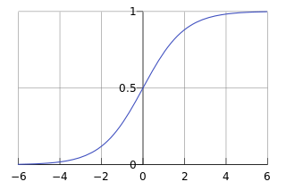

# Logistic Regression

## Introduction

Logistic Regression (LR) is actually a classification problem, although it names itself as "regression". It is mainly used for the binary classification, by utilizing the Logistic Function - Sigmoid. Obviously, its value locates within (0, 1). Usually, it takes 0.5 as the threshold, below which it classifies the observed set of inputs as class "0", and vice versa. Sigmoid function is presented as a pretty S-curve.

Logistic Regression Classifier aims at learning a binary classification model from the features of the input training data. The model takes the linear combination of the input feature as the variable,$\theta_0+\theta_1x_1+,\ldots,+\theta_nx_n=
\sum_{i=1}^n \theta_ix_i$，where $x_0$ is always 1. We can also present it as $\theta^Tx$.  Putting it into the sigmoid function, we get a prediction model as:
$$
h_\theta(x)=g(\theta^Tx)=\frac{1}{1+e^{-\theta^Tx}}
$$
LR finally maps the combination variable to (0, 1) to determine the class of the input features. 

In order to train such a logistic model, we need to build a reasonable loss function. But before that, we firstly define the probability of classes  (0 or 1)  as follows: 

$$
\begin{equation} \begin{aligned}&P(y=1\mid x;\theta)=h_\theta(x)\\&P(y=1\mid 0;\theta)=1-h_\theta(x)\end{aligned}\end{equation}
$$
It means for a set of input features denoted as $x_i$ and their correspondent labels $y_i$, the probability of $y_i = 1$ under $x_i$ is $p_i$ and hence the probability of $y_i = 0$  is  $1-p_i$. Therefore, we can combine the two cases and get a unified probability function as:

$$
P(y)\mid x;\theta)=(h_\theta(x))^y(1-h_\theta(x))^{1-y}
$$
Further, for m number of input features $x_1, x_2, ...... , x_m$, the joint probability is simply the multiplication of the probability of each $y_i$ under $x_i$, as follows:

$$
L(\theta)=\prod_{i=1}^{m}{P=(y_i\mid x_i;\theta)}=\prod_{i=1}^{m}(h_\theta(x_i))^{y_i}(1-h_\theta(x_i))^{1-y_i}
$$
The purpose of LR is to obtain an optimal set of parameter set $\theta$ that could lead to the maximum $L(\theta)$. Taking its logarithm form, we get $l(\theta)$ as: 

$$
l(\theta)=\log{L(\theta)}=\sum_{i=1}^m \Big(y_i\log h_\theta(x_i)+(1-y_i)\log \big(1-h_\theta(x_i)\big)\Big)
$$
If we regard  $l(\theta)$ as the loss function, training the LR problem should use gradient ascent manner, because $l(\theta)$ is the larger the better. If we want to minimize the loss function ( to coincide with the mainstream machine learning training method), we can simply use its minus as: $J(\theta)=-\frac{1}{m}*l(\theta)$, and we could use the gradient descent to issue the parameter optimization: $\theta_j:=\theta_j-\alpha\frac{\delta}{\delta_{\theta_j}}J(\theta)$

where:

$$
\begin{aligned}&\frac{\delta}{\delta_{\theta_j}}J(\theta)=-\frac{1}{m}\sum_{i=1}^m  \Big(y_i\frac{1}{h_\theta(x_i)}\frac{\delta}     {\delta_{\theta_j}}h_\theta(x_i)-(1-y_i)\frac{1}{1-h_\theta(x_i)}\frac{\delta}{\delta_{\theta_j}}h_\theta(x_i)\Big)\\&=-\frac{1}{m}\sum_{i=1}^m  \Big(y_i\frac{1}{g(\theta^Tx_i)})-(1-y_i)\frac{1}{1-g(\theta^Tx_i)}\Big)  \frac{\delta}{\delta_{\theta_j}}g(\theta^Tx_i)\\&=-\frac{1}{m}\sum_{i=1}^m  \Big(y_i\frac{1}{g(\theta^Tx_i)})-(1-y_i)\frac{1}{1-g(\theta^Tx_i)}\Big)  g(\theta^Tx_i)\big(1-g(\theta^Tx_i)\big)\frac{\delta}{\delta_{\theta_j}}\theta^Tx_i\\   &=-\frac{1}{m}\sum_{i=1}^m  \Big(y_i\big(1-g(\theta^Tx_i)\big)-(1-y_i)g(\theta^Tx_i)\Big)x_i^j\\&=-\frac{1}{m}\sum_{i=1}^m\Big(y_i-g(\theta^Tx_i)\Big)x_i^j\\&=-\frac{1}{m}\sum_{i=1}^m\Big(h_\theta(x_i)-y_i)\Big)x_i^j  \end{aligned}
$$

## Vectorization

The parameter optimization process could be vectorized, which is of great importance in FHE. We could use the following process for the vectorization: 

Firstly, we reform the $m$ number input vector $x$ as more fine-grained feature matrix for each observed feature, similar for the output class $y$ and the parameter set $\theta$:

$$ x= \left[\matrix{  x_1\\  \cdots\\  x_m}\right]=\left[\matrix{  x_{11} &  \cdots & x_{1n}\\  \vdots &  \ddots   & \vdots  \\  x_{m1} &  \cdots & x_{mn}}\right],y=\left[\matrix{  y_1\\  \cdots\\  y_m}\right],\theta=\left[\matrix{  \theta_0\\  \cdots\\  \theta_n}\right]\\ $$

The linear combination of each feature $x_i$ and the parameter set $\theta$ could then be presented as matrix-vector multiplication. The resulting matrix $A$ is used as input of the sigmoid function $g$:

$$ A=x \cdot \theta^T=\left[\matrix{  x_{10} &\cdots & x_{1n}\\  \vdots &  \ddots   & \vdots  \\  x_{m1} &  \cdots & x_{mn}}\right]\cdot \left[\matrix{  \theta_0\\  \cdots\\  \theta_n}\right]=\left[\matrix{  \theta_0x_{10}+\theta_1x_{11}+\ldots+\theta_0x_{1n}\\  \cdots\\  \theta_0x_{m0}+\theta_1x_{m1}+\ldots+\theta_0x_{mn}}\right]\\ $$

$$ E=h_\theta(x)-y=\left[\matrix{  g(A_1)-y_1\\  \cdots\\  g(A_m)-y_m}\right]=\left[\matrix{ e_1\\  \cdots\\  e_m}\right]=g(A)-y $$

$E$ is the error (or loss) between the observed label $y$ (0 or 1) and the predicted probability obtained by the sigmoid function with $x$. Therefore, the final optimization is presented as follows: 

$$ \theta_j:=\theta_j-\alpha\frac{1}{m}\sum_{i=1}^m\big(h_\theta(x_i)-y_i)\big)x_i^j=\theta_j-\alpha\frac{1}{m}\sum_{i=1}^me_ix_i^j=\theta_j-\alpha\frac{1}{m}x^{jT} E $$

## Implementation

1. Encoding

## Performance

The environment is as follows:

