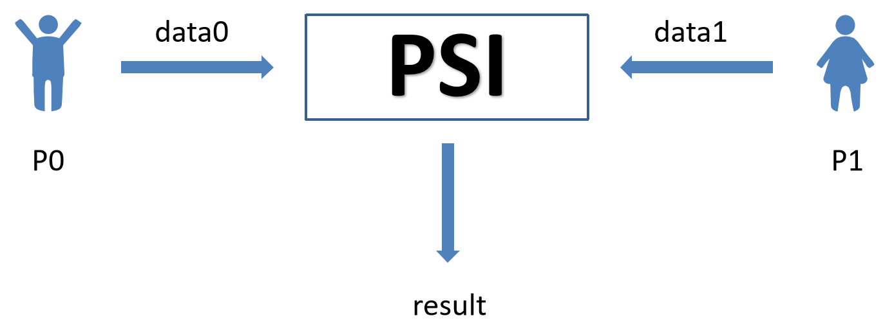
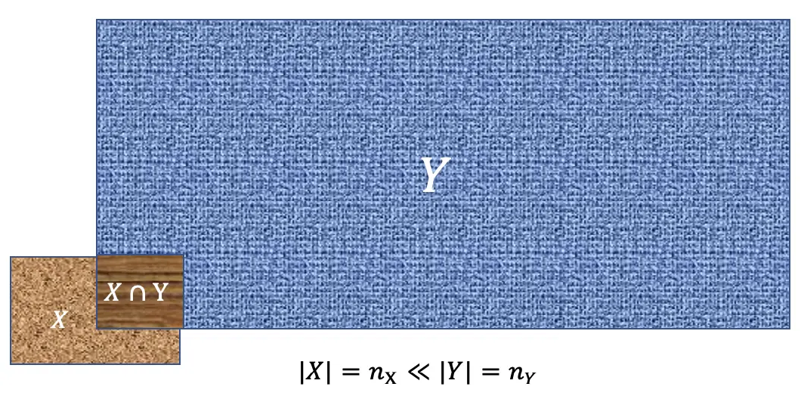
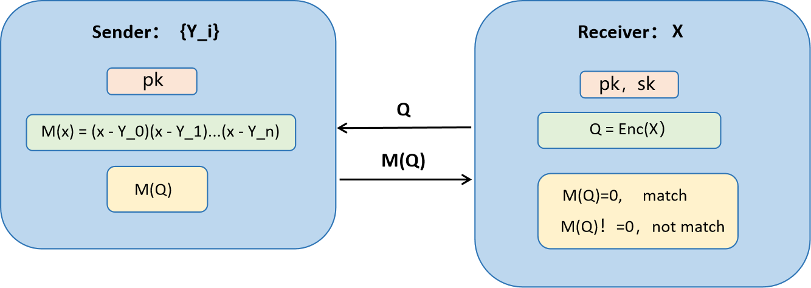
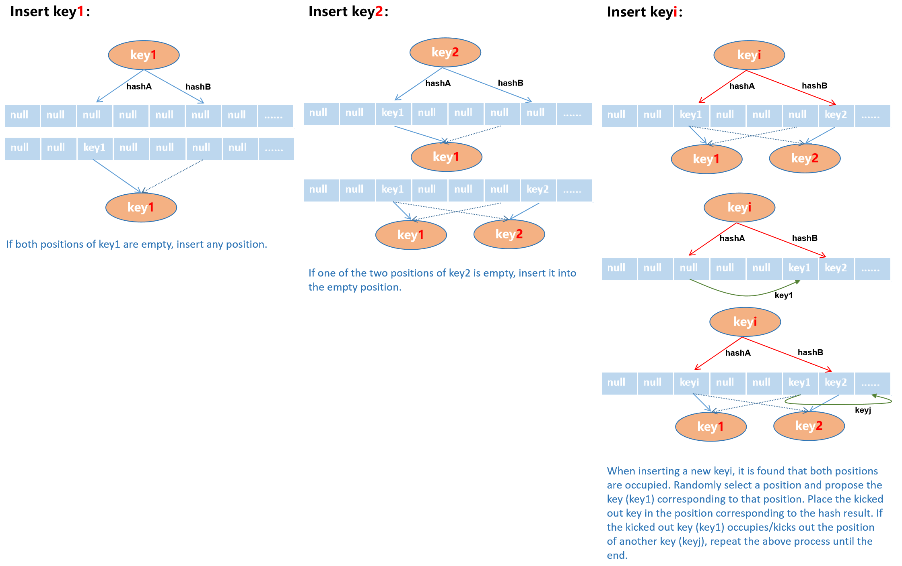
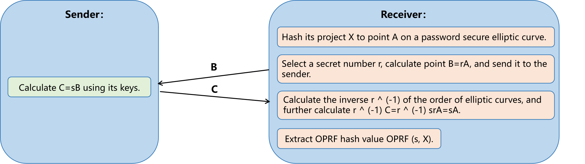

# Private Set Intersection (PSI)

## Introduction

Private Set Intersection (PSI) is a cryptographic technique that allows two parties to find the common elements in their respective sets without revealing any other information about their sets to each other. This means they can identify what data they share in common, without disclosing any data that isn't shared. PSI is crucial in contexts where privacy and confidentiality are important, such as in secure data sharing, privacy-preserving data analysis, and in cybersecurity, enabling collaboration and data comparison without compromising sensitive information.



<br>

**Unbalanced PSI**

Unbalanced Private Set Intersection (Unbalanced PSI) refers to a variant of Private Set Intersection (PSI) protocols tailored to the situation where there is a large disparity in set sizes between the two participating parties. PSI is a cryptographic technique that allows two parties to compute the intersection of their private sets without revealing any additional information about their sets other than what can be inferred from the intersection itself.



**Applications of Unbalanced PSI:**
<br>

<ul>
  <li>Ad Networks: Where a client wants to check if any of its small set of identifiers (like cookies or ad identifiers) intersect with a large database of opted-out users.</li>
  <li>Threat Intelligence Sharing: When a small organization wants to check its indicators of compromise (IoCs) against a larger organization's extensive threat database without revealing its IoCs.</li>
  <li>Biometric Matching: In scenarios where a client wishes to check if a biometric identifier matches any in a large database, without revealing the identifier or learning about other entries in the database.</li>
</ul>

**Intersection of privacy sets based on Homomorphic Encryption:**

The intersection of privacy sets based on Homomorphic Encryption (HE) is a sophisticated application of cryptographic techniques to perform secure computations on encrypted data. Homomorphic Encryption allows for operations to be carried out on ciphertexts, producing an encrypted result that, when decrypted, matches the result of operations performed on the plaintext. This capability is particularly useful for privacy-preserving computations, such as securely computing the intersection of two sets without revealing the contents of either set to the other party. This is a crucial functionality in scenarios like secure data sharing between organizations, privacy-preserving data mining, and secure multi-party computation.

<br>



<style>
    img[alt="p2"]{
        width:500px;
    }

</style>

<br>

## Security reinforcement methods
We used two methods to enhance the security of the algorithm:

<ul>
  <li>Cuckoo hash</li>
  <li>OPRF</li>
</ul>


**Cuckoo hash**

Cuckoo hashing is a hashing technique that can efficiently solve conflict problems. In PSI, it can be used to construct data structures for efficient processing and searching of elements in a set.

<ol>
  <li>Hash table initialization:<ul><li>Multiple Hash Functions: Cuckoo hashing utilizes two or more hash functions to determine the potential positions for each element in the hash table. This redundancy is key to resolving collisions.</li><li>Hash Tables Setup: Each participant prepares their dataset by applying cuckoo hashing. This involves initializing two or more hash tables, where each element in their dataset is hashed to one or more positions based on the hash functions. The use of multiple tables and hash functions increases the flexibility and efficiency in handling collisions.</li></ul></li>
  <li>Data insertion and search:<ul><li>Insertion Process: When inserting an element, if the designated position in the hash table is already occupied, cuckoo hashing requires that the occupying element be "kicked out" or "squeezed out". The displaced element is then hashed using its other hash function(s) to find an alternative position. This process might repeat multiple times until all elements are successfully placed or a loop is detected. In practice, to avoid infinite loops, a maximum number of displacements is set.</li><li>The search operation in cuckoo hashing is highly efficient because each element is mapped to a very limited number of positions (usually two). To find an element, one only needs to check these few positions determined by the hash functions. This dramatically reduces the search space and time, especially compared to traditional hashing methods where a search might involve traversing through a linked list of collided elements.</li></ul></li>

</ol>

<br>



<style>
    img[alt="p3"]{
        width:1600px;
    }

</style>

<br>

**OPRF**

Oblivious Pseudo-Random Function (OPRF) is an important cryptographic protocol widely used for enhancing privacy protection in data processing and searching operations. OPRF enables one party (the client) to securely compute the value of a pseudo-random function from another party (the server) without revealing its input to the server.

<ol>
  <li>Protocol Initialization:<ul><li>Input Blinding: The first step in the OPRF protocol involves the client blinding its input. This means the client applies a randomization operation to its input to ensure the true value of the input remains private from the server. This step is crucial for preserving input privacy.</li><li>Key and Function Setup: The server possesses a private key used for the computation of its pseudo-random function. This private key is not disclosed, ensuring the security and unpredictability of the server-side computation.</li></ul></li>
  <li>Data Processing and Search<ul><li>Blinded Data Processing: When the client sends its blinded data to the server, the server performs the pseudo-random function computation using its private key on these blinded inputs and returns the computation results to the client. During this step, the server cannot discern the client's original input, thus protecting client data privacy.</li><li>Efficient Data Recovery and Verification: After receiving the pseudo-random function computation results from the server, the client "unblinds" them to recover the actual pseudo-random function output values. This process allows the client to verify data or perform subsequent operations without revealing the original input. Since the client's input remains private throughout the process and the server's computations are based only on blinded inputs, this significantly reduces the risk of data leakage and enhances operational efficiency.</li></ul></li>

</ol>

<br>



<style>
    img[alt="p4"]{
        width:700px;
    }

</style>

<br>

## Reduce depth
APSI typically involves intensive computation, especially when dealing with large-scale datasets, where complex computational steps may result in significant computational overhead. By optimizing data structures and algorithms, the depth of these calculations can be reduced, thereby reducing overall computational and communication costs.
<br>

<ul>
  <li>Reduce multiplication depth: Divide the sender's set into S equally sized parts and independently evaluate the matching polynomial for each part</li>
  <li>Using batch processing: For each S part mentioned above, the sender's set can be further divided into poly_modulus_degree equal sized parts. The receiver can batch encrypt its data items to generate a query ciphertext Q=Enc ([X, X,..., X]).</li>
  <li>Receiver pre calculates query powers: The receiver pre calculates certain powers of the query, encrypts them, and sends them along with Q to the sender</li>
</ul>

<br>

## Code

APSI builds contain a lot of test cases:
1. Divided into unlabeled and labeled
2. Divided into large data volume and small data volume
3. Divided into single-threaded and multi-threaded

**Test function** : 
```cpp
void RunUnlabeledTest(size_t sender_size, vector<pair<size_t, size_t>> client_total_and_int_sizes,
                      const PSIParams &params, size_t num_threads,
                      bool use_different_compression = false)
void RunLabeledTest(size_t sender_size, vector<pair<size_t, size_t>> client_total_and_int_sizes,
                    const PSIParams &params, size_t num_threads)
```
* `sender_size` (size_t): the sender's size.
* `client_total_and_int_sizes` (vector<pair<size_t, size_t>>): A set of tests. The first term of each pair is the client size, and the second term is the number of intersections.
* `params` (PSIParams): Basic parameter table
* `num_threads` (size_t): Number of threads.

<br>

**Class PSIParams**

Provide some initialization parameters. This is required to initialize SenderDB class and Receiver class.
Construction: `create_params1()`, `create_params2()`, `create_huge_params1()` and `create_huge_params2()`.

<br>

**Member function (Class SenderDB)**

```cpp
OPRFKey SenderDB::get_oprf_key() const;
```

**Usage**: get oprf key.

```cpp
void set_data(const std::vector<Item> &data)
```
* `data` (std::vector<Item>): Data of the matched party.

**Usage**: Initialize the database.

<br>

**Member function (Class Sender)**

```cpp
static void RunOPRF(const OPRFRequest &oprf_request, oprf::OPRFKey key, network::Channel &chl,
      std::function<void(network::Channel &, Response)> send_fun = BasicSend<Response::element_type>);
```
* `oprf_request` (OPRFRequest): Created by function `to_oprf_request`.
* `key` (oprf::OPRFKey): Get from function `get_oprf_key`.
* `chl` (network::Channel): Should have Request.

**Usage**: Execute oprf.

```cpp
static void RunQuery(const Query &query, network::Channel &chl,
    std::function<void(network::Channel &, Response)> send_fun = BasicSend<Response::element_type>,
    std::function<void(network::Channel &, ResultPart)> send_rp_fun = BasicSend<ResultPart::element_type>);
```
* `query` (Query): query should be constructed.
* `chl` (network::Channel): chl should have QueryRequest.

**Usage**: Execute query.

<br>

**Member function (Class Receiver)**

```cpp
static oprf::OPRFReceiver Receiver::CreateOPRFReceiver(const vector<Item> &items)
```
* `items`(std::vector<Item>): The data being transformed.
* Return (oprf::OPRFReceiver): This result is a create request.

**Usage**: Perform oprf transformation on the queried data.

```cpp
static Request Receiver::CreateOPRFRequest(const OPRFReceiver &oprf_receiver)
```
* `oprf_receiver`(OPRFReceiver): created by function `CreateOPRFReceiver`

**Usage**: create request.

```cpp
static pair<vector<HashedItem>, vector<LabelKey>> Receiver::ExtractHashes(const OPRFResponse &oprf_response, const OPRFReceiver &oprf_receiver)
```
* `oprf_response`(OPRFResponse): created by function `to_oprf_response`
* `oprf_receiver`(OPRFReceiver): created by function `CreateOPRFReceiver`
* Return (vector<HashedItem>, vector<LabelKey>): Part one prepare for query, part two prepare for decrypt.

**Usage**: Extracting the hash prepares the query for creation.

```cpp
std::pair<Request, IndexTranslationTable> create_query(const std::vector<HashedItem> &items);
```
* `items` (std::vector<HashedItem>): created by function `ExtractHashes`
  
**Usage**: create query.
