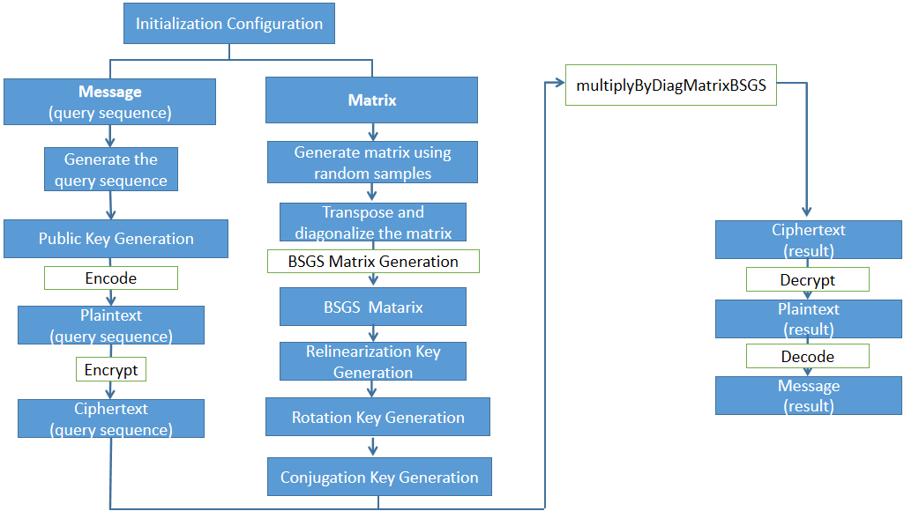
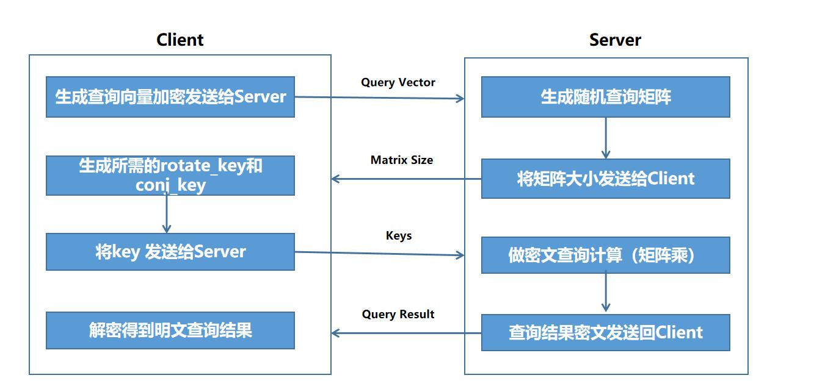

# Private Information Retrieval (PIR)

## Introduction

Private Information Retrieval, also known as covert search, is a very practical technology and application in secure multi-party computing that can be used to protect users' query privacy and thus their query results. The goal is to ensure that when users submit query requests to the data source, they complete the query without being perceived or leaked. For the data source, they only know that a query has arrived, but they do not know the true query conditions, so they do not know what the other party has checked.

**Query process**

1. The data stored by the data provider in the database is in the format of<key, value>;

2. The query party uses the key they want to query, encrypts it, and then goes to the data party to query the corresponding value;

3. During the query process, the data provider is unable to determine the specific key of the query provider, and it is not clear which value was ultimately sent to the query provider.

 

## Application Flowchart

 
 

## Matrix Construction Method

 
 

 
 

 
 
 

**Integration with PrimiHub to complete PIR**

