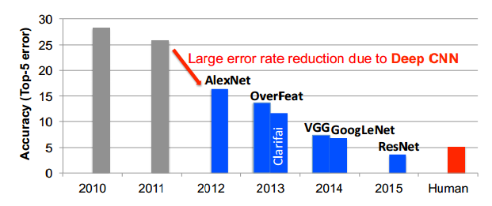
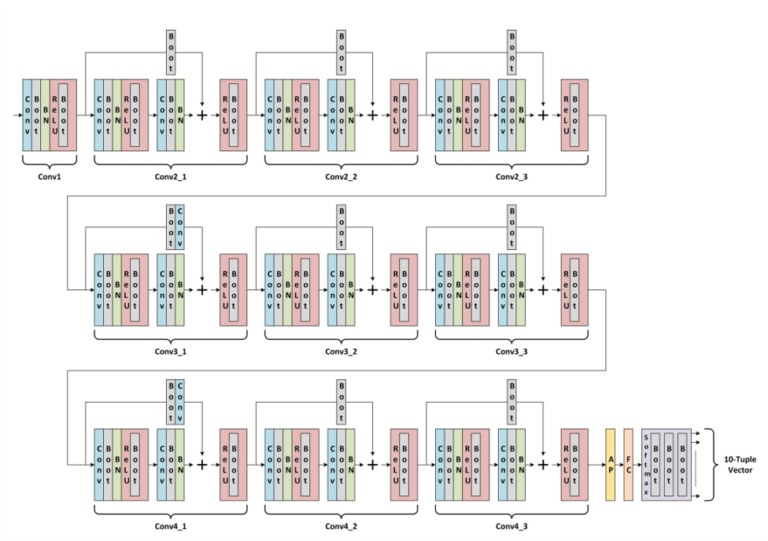
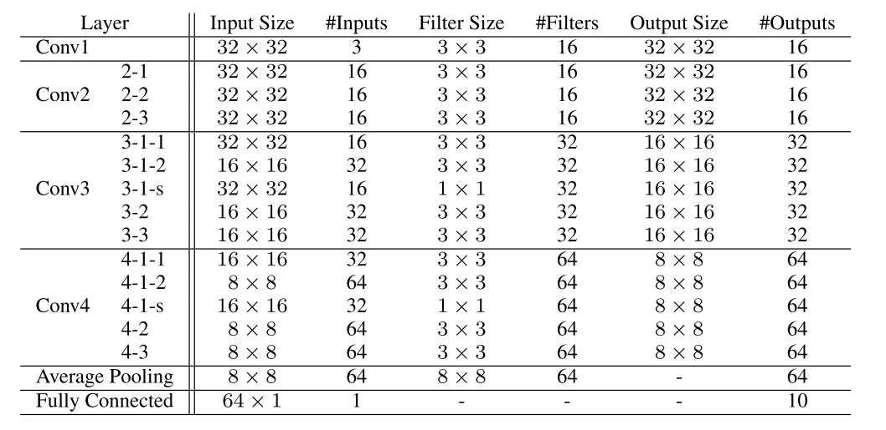
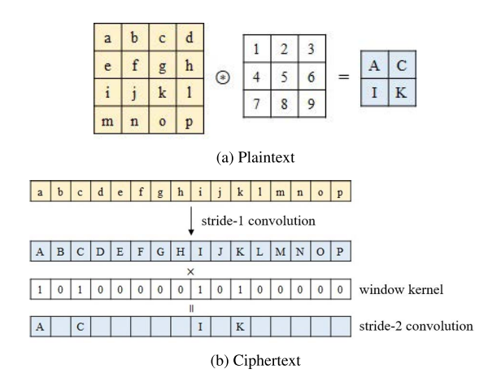
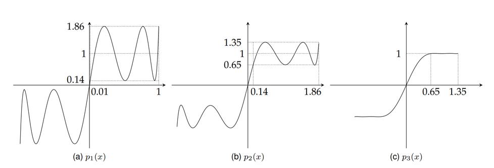

## Introduction

As an attempt to utilize Poseidon at convolutional neural networks, we implement the ResNet-20 model for the CIFAR-10 dataset. ResNet presents a residual learning framework to ease the training of networks that are substantially deeper than those used previously, and achieves 3.57% error on the ImageNet test set. This result won the 1st place on the ILSVRC 2015 classification task. 

 
 
 

 

 
 

**ResNet20 based on Fully Homomorphic Encryption:**
1. Use bootstrapping to reserve enough multiplication depths.
2. Use approximated polynomials to implement ReLU function, which is a transcendental funtion.

## Architecture

 

## Convolution

We transform 2-dimension matrixes into linear vectors to calculate convolution.

## ReLU Method

Instead of calculating ReLU function directly, we aim at $sign(x)$ first. As it is an odd funtion, we attempt to approximate it by component of odd polynomials. For $x$ within the domain of $[0.01, 1]$, we are able to construct an odd funtion $p1(x)$ to map $x$ into $[0.14, 1.86]$. Then construct odd functions $p2(p1(x))$ and $p3(p2(p1(x)))$, which finally maps $x$ from $[0.01, 1]$ to $1$. 

At last, make use of the sign funtion: $ReLU(x) = (sign(x)+1)*x/2$ to implement ReLU function.
