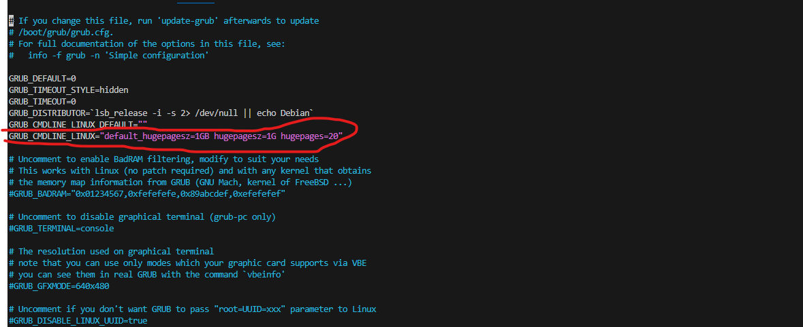
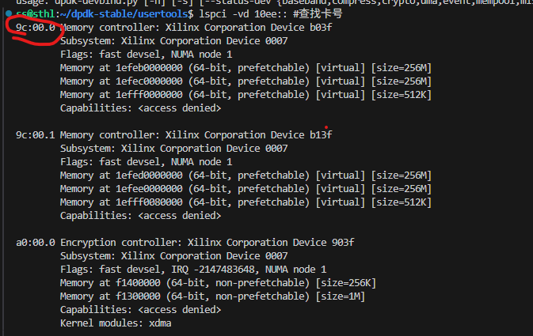

# Poseidon hardware compile

**Must read: This article is a guide to compiling and using hardware versions. Poseidon is divided into software and hardware versions. The hardware version is to hardware accelerate the operator, based on this software code, you also need a hardware acceleration card and corresponding drivers, incremental installation packages, etc. Do not use this method if you do not have the necessary conditions such as a hardware card.**

If you don't have the necessary conditions such as a hardware card, use an open-source software library.[Software(poseidon)](./Software(poseidon).md)
<br>

Here are our recommendation for different users:

1. Direct installation. It is convenient when installing hardware libraries.
2. The software part is compiled from the source code, and the hardware part is an incremental installation package. This allows you to make changes to the software section later.

<br>

## Requirement 

* Operating System: Ubuntu >= 18.04 LTS , CentOS >= 7.0
* Tool chain: GNU g++ ( >= 8.0) , CMake ( >= 3.12 )
* Dependency library: gmp ( >= 6.3.0)

<br>

## Source Code Download

Download the software source code from the following link: [SourceCode](https://github.com/luhang-HPU/poseidon)

<br>

## Installation steps

***If you don't use hardware, don't use this method!!!***

***This requires the hardware library to be installed before compiling!!!***

<br>

### Step 1: Install dpdk

```shell
# install dpdk
# 1.dpdk dependency
sudo apt-get install libnuma-dev
# Add to << GRUB_CMDLINE_LINUX="default_hugepagesz=1GB hugepagesz=1G hugepages=20" >> like p1
vim /etc/default/grub file
sudo update-grub
# Be careful !!!!! You need to restart your computer!
sudo reboot

# 2.Compile and link
# download dpdk-stable, use http or ssh
git clone https://github.com/luhang-HPU/dpdk-stable.git #http
git clone git@github.com:luhang-HPU/dpdk-stable.git #ssh

# go to the folder and build
cd dpdk-stable
meson build --prefix=/usr/local
cd build
ninja
sudo ninja install
sudo ldconfig
```


<br>

### Step 2: Install Hardware Library

You have two options for installation.

#### Scheme 1: Direct installation.

```shell
# download and install
wget https://gitee.com/luhang-CCL/poseidon/raw/master/downloads/poseidon-1.0.0_x86_64.deb
sudo apt-get install ./poseidon-1.0.0_x86_64.deb
# uistall maybe need
# sudo apt-get remove poseidon
```

<br>

#### Scheme 2: Partial source code compilation of software.

Open source software libraries are compiled into dependency packages according to the way hardware libraries are compiled. **This way allows you to make changes to the software section later**.

```shell
# Download and install the dependency package
wget https://gitee.com/luhang-CCL/poseidon/raw/master/downloads/poseidon-hardware-1.0.0_x86_64.deb
sudo apt-get install ./poseidon-hardware-1.0.0_x86_64.deb

# uistall maybe need
# sudo apt-get remove poseidon

# Compile software part dependent above package
# download the source code, use http or ssh
git clone https://github.com/luhang-HPU/poseidon.git #http
git clone git@github.com:luhang-HPU/poseidon.git #ssh

# go to the folder
cd poseidon
# create a compilation directory
mkdir -p build && cd build

# compile, the executable program will be in ./bin/
# ps: requires VPN!!!
cmake -DPOSEIDON_USE_HARDWARE=ON ..
make -j

# install the library
# default install dir
# header files: /usr/local/include/poseidon/
# library file: /usr/local/lib/
sudo make install
sudo ldconfig
```

<br>

### Step 3: Install driver and Bind port

```shell
# If the server reboot needs to be executed again.
# Go to dpdk-stable folder

# 1.Install the driver.
cd dpdk-stable/dpdk-kmods/linux/igb_uio
make
sudo modprobe uio
sudo insmod igb_uio.ko
# Check if it is installed
lsmod | grep igb_uio

# 2.Bind port. If the server reboot needs to be executed again.
cd ../../../usertools/
# Switch users to root. Cards and hardware libraries are linked
# Find the card number as shown in p2 below
lspci -vd 10ee::
# ${card_id} is a variable, please replace it yourself.
echo 1 > /sys/bus/pci/devices/0000:${card_id}/remove
echo 1 > /sys/bus/pci/rescan
./dpdk-devbind.py -b igb_uio ${card_id}
```


<br>

## Execute the Examples

**Method one**
After installation.

```shell
# In build folder 
./bin/test_example_file_name 
```

**Method two**
If you only compiles single file, you can use the examples with the following command.

```shell
# Please replace the internal variables with the actual file
g++ ${filename}.cpp -o ${filename} -I${poseidon_header_path} -lposeidon_shared -std=c++17

```

## Cmake Variables

Poseidon provides a range of cmake variables for users to choose from. For the experience of use, try to keep the default options.

| CMake Variable          | Type | Usage                    | Default |
| ----------------------- | ---- | ------------------------ | ------- |
| POSEIDON_BUILD_EXAMPLES | bool | Build Poseidon examples  | ON      |
| POSEIDON_USE_ZSTD       | bool | Use zstd                 | ON      |
| POSEIDON_USE_ZLIB       | bool | Use zlib                 | ON      |
| POSEIDON_USE_MSGSL      | bool | Use msgsl                | ON      |
| POSEIDON_USE_HARDWARE   | bool | Whether hardware is used | OFF     |


POSEIDON_BUILD_EXAMPLES: An example is an application based on the Poseidon library, which can be turned off to speed up the compilation of parts of the poseidon library
POSEIDON_USE_ZSTD, POSEIDON_USE_ZLIB, POSEIDON_USE_MSGSL: Some additional dependencies. The advantage of **turning it off** is that you don't need a VPN during the compilation process, **but the disadvantage is that it will cause some applications to not work.**
POSEIDON_USE_HARDWARE: It can be enabled on the premise that the hardware card meets the requirements and has hardware dependencies.

<br>

If you encounter any problems with compilation and installation, please feel free to contact us via email at luhang@ict.ac.cn