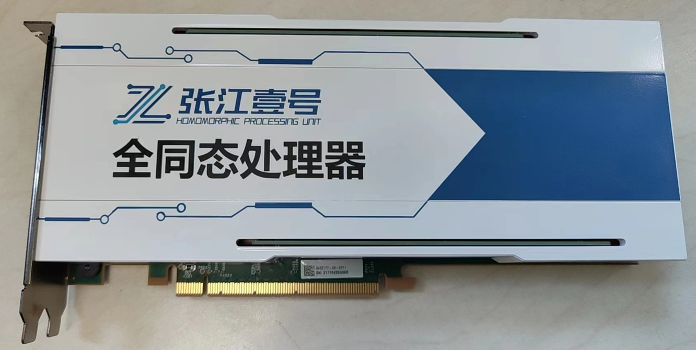

# Homomorphic Computing Unit (HPU)

Poseidon library is tightly coupled with the specialized FHE hardware accelerator, namely **ZhangJiang No.1** or **ZJ-1** for simplicity. **ZJ-1** is a PCIe interfaced SoC, providing highly parallelized computation for various FHE operations defined in Poseidon. It is a highly pipelined architecture with fine-grained operator executing on the timing-optimized micro-architecture.

 

