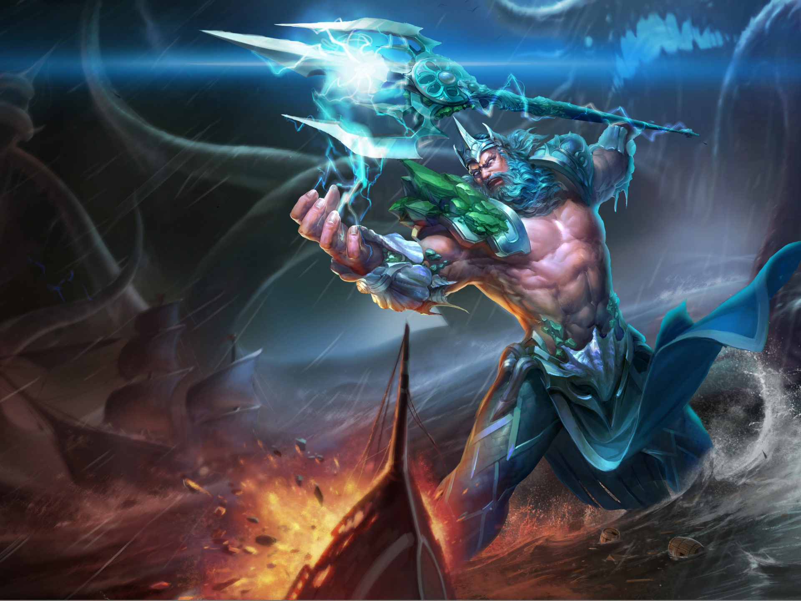

# Welcome to Poseidon Documentation

   

## Overview

* [Poseidon Introduction](./Overview/Poseidon_Basics.md)
* [Homomorphic Computing Unit (HPU)](./Overview/HPU.md)

## Getting Started

1.  Poseidon Installation

     * [Software Library](./Getting_Started/Compile and Installation/Software(poseidon).md)
     * [Hardware Library](./Getting_Started/Compile and Installation/Hardware(poseidon with HPU).md)

     

2. FHE APIs

     * [Basics](./Getting_Started/API/Basic API.md)
     * [BFV](./Getting_Started/API/FHE schemes/BFV API.md)
     * [BGV](./Getting_Started/API/FHE schemes/BGV API.md)
     * [CKKS](./Getting_Started/API/FHE schemes/CKKS API.md)

     

3. Programming

     * [How to Program](./Getting_Started/Programming/How to Program.md)

     * [Examples](./Getting_Started/Programming/Examples.md)

## Trident Benchmark

1. [Introduction](./Benchmark/Introduction/Introduction.md)

2. [Trident Installation](./Benchmark/Install/Trident Installation.md)

3. Applications
     * [Framingham Heart Study](./Benchmark/Application/Framingham.md)
     * [Private Information Retrieval (PIR)](./Benchmark/Application/pir_bfv.md)
     * [Private Set Intersection (PSI)](./Benchmark/Application/PSI.md)
     * [Logistic Regression Train (LR Train)](./Benchmark/Application/LR Train.md)
     * [K-Nearest Neighbor (KNN)](./Benchmark/Application/knn.md)
     * [MNIST-CNN](./Benchmark/Application/MNIST-CNN.md)
