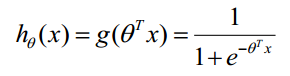
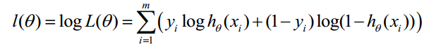
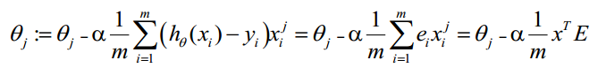

## Introduction

Logistic Regression is a generalized linear model mainly used in binary classification. It works as a classifier utilizing Logistic function (also named Sigmoid function). Logistic Regression Classifier aims at learning a binary classification model from the features of training data. The training process is to construct a prediction function with Logistic function and to iterate the loss within each epoch.

 

 
 

## Derivation of the gradient

The logarithm of Loss function:

Then, we have the gradient:

 

## Vectorization Method
 

We encode and encrypt each $x_i$ into a ciphertext, calculated with the encrypted weight $[\theta_i]$ to get the loss.
Then update the weight:

