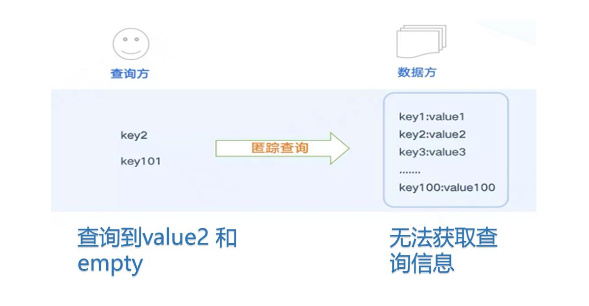
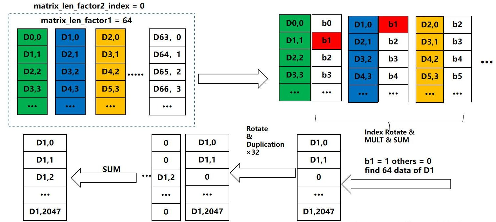
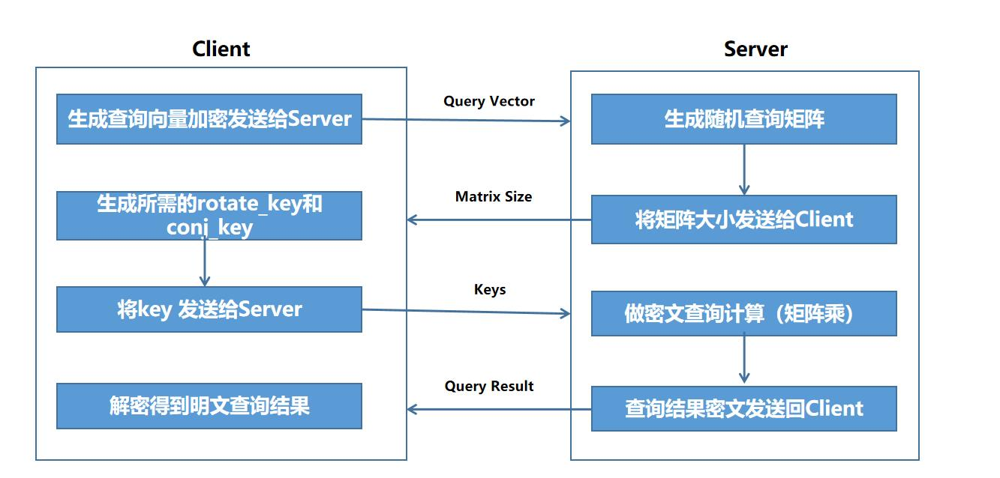

## Introduction

<div style="text-align: justify">
Private Information Retrieval, also known as covert search, is a very practical technology and application in secure multi-party computing that can be used to protect users' query privacy and thus their query results. The goal is to ensure that when users submit query requests to the data source, they complete the query without being perceived or leaked. For the data source, they only know that a query has arrived, but they do not know the true query conditions, so they do not know what the other party has checked.
<br>
<br>
<br>


<style>
    img[alt="box"]{
        width:600px;
    }
</style>

<br>
<br>

**Query process**

1. The data stored by the data provider in the database is in the format of<key, value>;

2. The query party uses the key they want to query, encrypts it, and then goes to the data party to query the corresponding value;

3. During the query process, the data provider is unable to determine the specific key of the query provider, and it is not clear which value was ultimately sent to the query provider.


<style>
    img[alt="im2"]{
        width:800px;
    }
</style>

<br>
</div> 


## Application Flowchart
<br>
<br>


<style>
    img[alt="flow"]{
        width:1000px;
    }
</style>
<br>
<br>

## Matrix Construction Method
<div style="text-align: justify">
<br>
<br>


<style>
    img[alt="m1"]{
        width:1000px;
    }
</style>
<br>
<br>


<style>
    img[alt="m2"]{
        width:1000px;
    }
</style>
<br>
<br>


<style>
    img[alt="m3"]{
        width:1000px;
    }
</style>
<br>
</div> 
<br>
<br>

<!-- ## DEMO used by the system
<br>

**Integration with PrimiHub to complete PIR**


<style>
    img[alt="demo"]{
        width:1000px;
    }
</style>
<br>
<br>
-->

## Code
<br>
<br>

```cpp
// Standard libraries for input/output and mathematical operations
#include <iostream>
#include <fstream>
#include <cstdlib>
#include <vector>
#include <cmath>
#include <complex>
#include <gmpxx.h>

// Poseidon library headers for Fully Homomorphic Encryption operations and utilities
#include "poseidon/Release/define.h"
#include "poseidon/Release/homomorphic_DFT.h"
#include "poseidon/Release/linear_transform.h"
#include "poseidon/Release/util/number_theory.h"
#include "poseidon/Release/hardware/ConfigGen.h"
#include <gmpxx.h>
#include "poseidon/Release/Ciphertext.h"

#include "poseidon/Release/util/matrix_operation.h"
#include "poseidon/Release/CKKSEncoder.h"
#include "poseidon/Release/BatchEncoder.h"
#include "poseidon/Release/random/random_sample.h"

#include "poseidon/Release/random/RandomGen.h"
#include "poseidon/Release/random/Blake2xbPRNG.h"
#include "poseidon/Release/KeyGenerator.h"
#include "poseidon/Release/Encryptor.h"
#include "poseidon/Release/Decryptor.h"
#include "poseidon/Release/ParametersLiteral.h"
#include "poseidon/Release/rlwe.h"
#include "poseidon/Release/RelinKeys.h"

#include "poseidon/Release/Evaluator.h"
#include "poseidon/Release/HardwareEvaluator.h"
#define RNS_C 2
#include "poseidon/Release/linear_transform.h"
#include "poseidon/Release/util/matrix_operation.h"

// Using the Poseidon namespace for clarity
using namespace poseidon;

int main() {
    //===================== Configuration ============================
    // Initialize CKKS parameters with a default degree of 2048
    CKKSParametersLiteralDefault ckks_param_literal(degree_2048);
    PoseidonContext context(ckks_param_literal);

    //===================== Initialize Random Data ===================
    // Create vectors to hold complex numbers and results
    std::vector<std::complex<double>> vec, vec_result, vec_result1;
    int mat_size = 1 << ckks_param_literal.LogSlots; // Determine matrix size based on log slots
    std::vector<vector<std::complex<double>>> mat(mat_size, vector<complex<double>>(mat_size, 0));
    std::vector<vector<std::complex<double>>> mat_T(mat_size);
    std::vector<vector<std::complex<double>>> mat_T1;
    
    // Create a message vector initialized with zeros
    vector<complex<double>> message(mat_size, 0);
    message[1] = 1;  // Set the second element to 1

    vector<complex<double>> message_tmp(mat_size);
    vector<complex<double>> message_sum(mat_size << 1, 0.0);

    //===================== Initialize Plaintext & Ciphertext ========
    Plaintext plainA, plainB, plainRes, plainRes1, plainT;
    Ciphertext cipherA, cipherB, cipherRes, cipherRes1, cipherRes2, cipherRes3;
    PublicKey public_key;
    RelinKeys relinKeys;
    GaloisKeys rotKeys;
    GaloisKeys conjKeys;
    CKKSEncoder ckks_encoder(context);

    //===================== Generate Matrices ========================
    MatrixPlain matrixPlain;
    // Populate the matrix with random complex numbers
    for (int i = 0; i < mat_size; i++) {
        sample_random_complex_vector2(mat[i], mat_size);
    }

    // Matrix operations
    auto level = context.crt_context()->maxLevel();
    matrix_operations::transpose_matrix(mat, mat_T1); // Transpose the matrix
    for (int i = 0; i < mat.size(); i++) {
        matrix_operations::diagonal(mat_T1, i, mat_T[i]);
    }
    GenMatrixformBSGS(matrixPlain, matrixPlain.rot_index, ckks_encoder, mat_T, level, context.crt_context()->primes_q()[level], 1, ckks_param_literal.LogSlots);

    //===================== Generate Keys ============================
    KeyGenerator kgen(context);
    kgen.create_public_key(public_key);
    kgen.create_relin_keys(relinKeys);
    kgen.create_galois_keys(matrixPlain.rot_index, rotKeys);
    kgen.create_conj_keys(conjKeys);

    Encryptor enc(context, public_key, kgen.secret_key());
    Decryptor dec(context, kgen.secret_key());

    //===================== Operations ===============================
    // Encode the message
    ckks_encoder.encode(message, plainA, context.scaling_factor());

    // Encrypt the plaintext
    enc.encrypt(plainA, cipherA);

    // Evaluation operations on the ciphertext
    auto ckks_eva = EvaluatorFactory::DefaultFactory()->create(context);
    auto start = chrono::high_resolution_clock::now();
    ckks_eva->multiplyByDiagMatrixBSGS(cipherA, matrixPlain, cipherRes, rotKeys);
    ckks_eva->read(cipherRes);

    // Decrypt and decode the resulting ciphertext
    dec.decrypt(cipherRes, plainRes);
    ckks_encoder.decode(plainRes, vec_result);

    // Display results
    for (int i = 0; i < 8; i++) {
        printf("result vec[%d] : %0.10f + %0.10f I \n", i, real(mat[1][i]), imag(mat[1][i]));
        printf("result vec[%d] : %0.10f + %0.10f I \n", i, real(vec_result[i]), imag(vec_result[i]));
    }

    return 0;
}

```