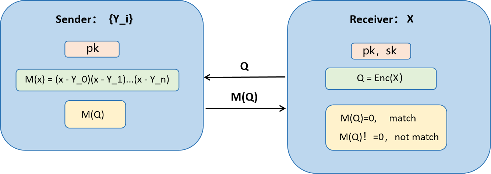
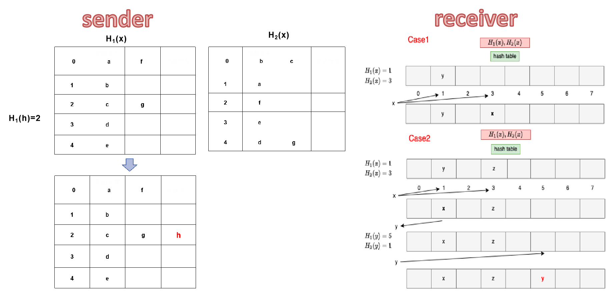
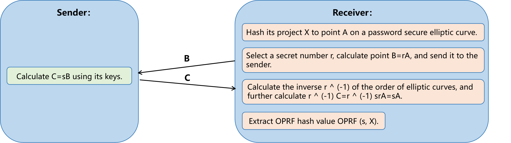

## Introduction

<div style="text-align: justify">

Private Set Intersection (PSI) is a cryptographic technique that allows two parties to find the common elements in their respective sets without revealing any other information about their sets to each other. This means they can identify what data they share in common, without disclosing any data that isn't shared. PSI is crucial in contexts where privacy and confidentiality are important, such as in secure data sharing, privacy-preserving data analysis, and in cybersecurity, enabling collaboration and data comparison without compromising sensitive information.
<br>
<br>
<br>

<center>


</center>

<style>
    img[alt="p1"]{
        width:500px;
    }

</style>

<br>

**Intersection of privacy sets based on Homomorphic Encryption:**
<br>
The intersection of privacy sets based on Homomorphic Encryption (HE) is a sophisticated application of cryptographic techniques to perform secure computations on encrypted data. Homomorphic Encryption allows for operations to be carried out on ciphertexts, producing an encrypted result that, when decrypted, matches the result of operations performed on the plaintext. This capability is particularly useful for privacy-preserving computations, such as securely computing the intersection of two sets without revealing the contents of either set to the other party. This is a crucial functionality in scenarios like secure data sharing between organizations, privacy-preserving data mining, and secure multi-party computation.
<br>

<center>



</center>

<style>
    img[alt="p2"]{
        width:500px;
    }

</style>

## Security reinforcement methods
We used two methods to enhance the security of the algorithm:
<br>
<ul>
  <li>Cuckoo hash</li>
  <li>OPRF</li>

</ul>

**Cuckoo hash**
<br>
Cuckoo hashing is a hashing technique that can efficiently solve conflict problems. In PSI, it can be used to construct data structures for efficient processing and searching of elements in a set.
<br>
<ol>
  <li>Hash table initialization:<ul><li>Multiple Hash Functions: Cuckoo hashing utilizes two or more hash functions to determine the potential positions for each element in the hash table. This redundancy is key to resolving collisions.</li><li>Hash Tables Setup: Each participant prepares their dataset by applying cuckoo hashing. This involves initializing two or more hash tables, where each element in their dataset is hashed to one or more positions based on the hash functions. The use of multiple tables and hash functions increases the flexibility and efficiency in handling collisions.</li></ul></li>
  <li>Data insertion and search:<ul><li>Insertion Process: When inserting an element, if the designated position in the hash table is already occupied, cuckoo hashing requires that the occupying element be "kicked out" or "squeezed out". The displaced element is then hashed using its other hash function(s) to find an alternative position. This process might repeat multiple times until all elements are successfully placed or a loop is detected. In practice, to avoid infinite loops, a maximum number of displacements is set.</li><li>The search operation in cuckoo hashing is highly efficient because each element is mapped to a very limited number of positions (usually two). To find an element, one only needs to check these few positions determined by the hash functions. This dramatically reduces the search space and time, especially compared to traditional hashing methods where a search might involve traversing through a linked list of collided elements.</li></ul></li>

</ol>

<br>

<center>



</center>

<style>
    img[alt="p3"]{
        width:1200px;
    }

</style>

<br>

**OPRF**
<br>
Oblivious Pseudo-Random Function (OPRF) is an important cryptographic protocol widely used for enhancing privacy protection in data processing and searching operations. OPRF enables one party (the client) to securely compute the value of a pseudo-random function from another party (the server) without revealing its input to the server.
<br>
<ol>
  <li>Protocol Initialization:<ul><li>Input Blinding: The first step in the OPRF protocol involves the client blinding its input. This means the client applies a randomization operation to its input to ensure the true value of the input remains private from the server. This step is crucial for preserving input privacy.</li><li>Key and Function Setup: The server possesses a private key used for the computation of its pseudo-random function. This private key is not disclosed, ensuring the security and unpredictability of the server-side computation.</li></ul></li>
  <li>Data Processing and Search<ul><li>Blinded Data Processing: When the client sends its blinded data to the server, the server performs the pseudo-random function computation using its private key on these blinded inputs and returns the computation results to the client. During this step, the server cannot discern the client's original input, thus protecting client data privacy.</li><li>Efficient Data Recovery and Verification: After receiving the pseudo-random function computation results from the server, the client "unblinds" them to recover the actual pseudo-random function output values. This process allows the client to verify data or perform subsequent operations without revealing the original input. Since the client's input remains private throughout the process and the server's computations are based only on blinded inputs, this significantly reduces the risk of data leakage and enhances operational efficiency.</li></ul></li>

</ol>

<br>

<br>

<center>



</center>

<style>
    img[alt="p4"]{
        width:700px;
    }

</style>

<br>

## Performance improvement and utilization of resource advantages
<br>


<style>
    img[alt="p5"]{
        width:600px;
    }
</style>

<br>

## Code

```
wget xxx
```