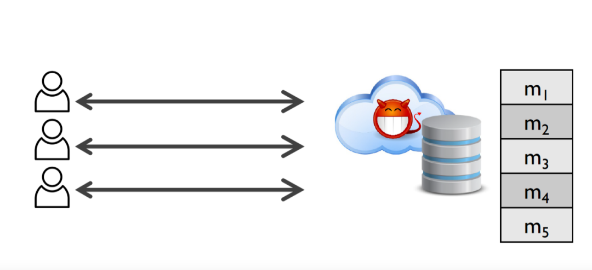
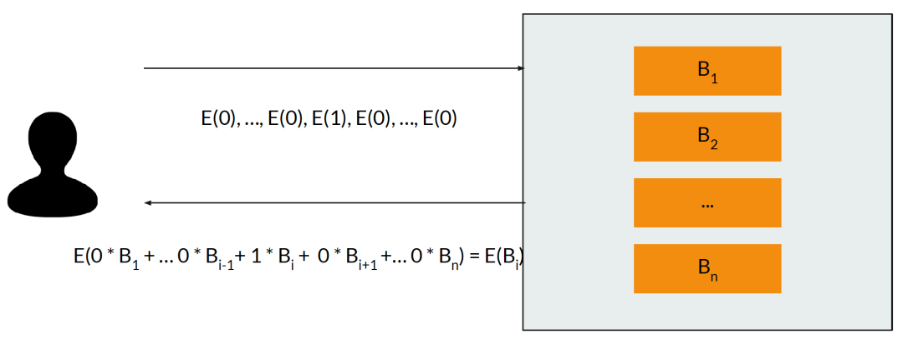
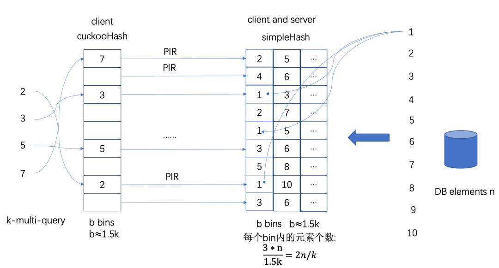

## Introduction

Private Information Retrieval (PIR), as an extension of Information Retrieval, ensures users submit query requests to the data source without being perceived or leaked. PIR protocol is supposed to meet two demands at the same time:
1. Correctness: Users get correct data as they request.
2. Security: The server does not know the true query conditions.

 

 
 

## Basic PIR

Suppose the amount of the data from the client is $n$. The basic procedure is as follows.
1. The client generates the secret key and the public key $(sk, pk)$ of BFV algorithm.
2. The client generates an n-dimension vector $(0, ..., 0, 1, 0, ..., 0)$, which sets $1$ at the position of the index inquired and $0$ at the other.
3. The client encrypts the inquiry vector with the public key and sends the ciphertext $(E(0), ..., E(0), E(1), E(0), ..., E(0))$ to the server.
4. The server receives the encrypted inquiry vector, multiplied with an n-demension vector constructed by the local data $(B_1, B_2, ..., B_n)$, gets $E(0 \cdot B_1 + ... + 0 \cdot B_{i-1} + 1 \cdot B_i + 0 \cdot B_{i+1} + ... + 0 \cdot B_n)$ and sends it to the client.
5. The client decrypts the ciphertext and gets the inquired data $B_i$.

The basic PIR protocol can be extracted into four functions: (Setup, Query, Answer, Extract).

## Data Packing

Consider the basic PIR protocol, which consumes a lot on the computation and the communication of the query requests since $n$ ciphertexts should be generated and sent each time.

Thus, we pack multiple data into one homomorphic encryption plaintext.

## Vector Transformer

We convert data from the linear vector into a 2-dimension matrix.

When we use a 2-dimension inquiry, most query requests can be supported within the two inquiry ciphertexts.

 

## Multiple Inquiries

We construct probabilistic batch code based on Cuckoo Hash, to divide the database into several batches, and execute multiple inquiries at the same time according to different batches.

