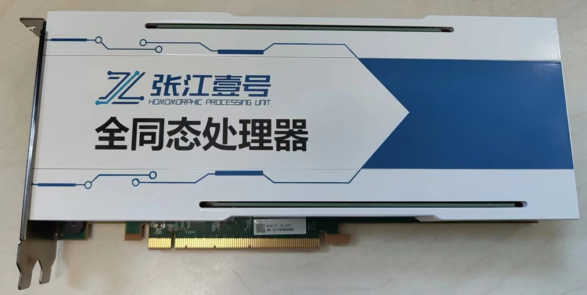

# Homomorphic Computing Unit (HPU)

Poseidon is tightly coupled with the specialized hardware accelerator for FHE, namely **ZhangJiang No.1** or **ZJ-1** for simplicity. ZJ-1 is a PCIe interfaced SoC, providing highly parallelized computation for various FHE operations defined in Poseidon. It is a highly pipelined architecture with fine-grained operator executing on the timing-optimized microarchitectures. 

The performance of ZJ-1 is listed in the following table. It is evaluated using end-to-end ciphertext-computing benchmarks, including ID-based PIR, Framingham Heart Study (a cardiac disease prediction methodology) and bootstrap. It is worth mentioning that bootstrap usually works under high polynomial degree (i.e. 32768), so we do not evaluate this benchmark under degree 2048 ~ 8192.

Currently, ZJ-1 serves as the FPGA-based accelerator card. We believe that the performance is supposed to be boosted up to 1 magnitude if the subsequent ASIC is successfully taped out. 

